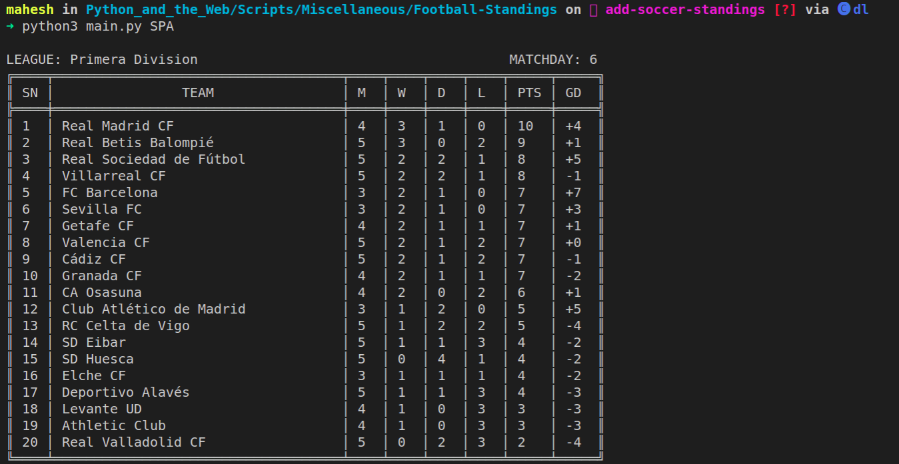

# Football Standings CLI

Fetches the latest standings of major football leagues and displays the standings right in your terminal!

### Prerequisites

This script requires a  **free** API Key from [football-data.org](https://www.football-data.org/) for fetching the up-to-date standings of leagues.

Save the Key obtained in **.env**  file as follows:

**Before:**
```bash
API_KEY=YOUR_KEY_HERE
```

**After:**
```bash
API_KEY=xxxxxxxxxxxxxxxxxx
```
> NOTE: No spaces around `=` as this is a shell file 

**Python prerequisites:**

Run this command to install all required packages.

```bash
$pip install -r requirements.txt
```

### How to run the script

```bash
$python3 main.py --help | -h        # For displaying league codes of supported leagues
$python3 main.py [league_code]      # For displaying realtime standings of the league
```
### Screenshot/GIF showing the sample use of the script




## Author:

[Mahesh Bharadwaj K](https://github.com/MaheshBharadwaj)