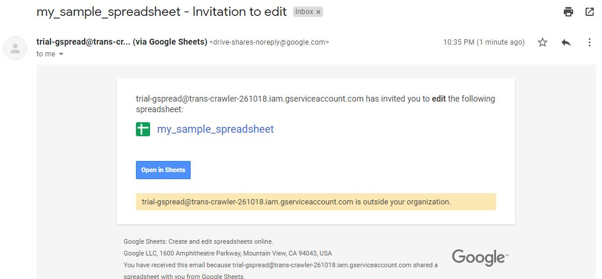

# Google Spreadsheet share and retrieve.

This script helps the user to upload a local csv file to google drive and share it with the user specified in the command.

The script also helps to retrieve the spreadsheet form the drive and store it locally in json format.

***

### Prerequisites
```
pip install -r requirements.txt
```

***

### How to run the script

1.  #### Create Google Sheets API credentials.

    a. Go to [Google Developer's Console](https://console.developers.google.com/apis/dashboard?project=trans-crawler-261018).

    b. Go to 'Library' from the left navigation panel.

    c. In the search bar type 'Google Sheets API'.

    d. Enable the API if not enabled or click on the manage button.

    e. Similarly enable the 'Google Drive API'.

    f. On the API page, goto 'Credentials' from the Navigation Panel.

    g. Click on 'Create Credentials', select the service account option and name the service account.

    h. Click on 'Add key' and 'Create New'.

    

    i. File download will begin, rename this file as 'credentials.json' and place in the same folder as the scripts.

2. #### Run the Scripts.

    * Share a spreadsheet
    
    ```
    python create_sheet.py -mail <mail_id> -csv <csv_file_name> -s <spreadsheet_name>
    ```

    * Retrieve the spreadsheet and store locally in json format

    ```
    python get_sheet.py -j <json_file_name> -s <spreadsheet_name>
    ```

***

### Screenshot showing the sample use of the script

1. Creating a google spreadsheet and sharing it with the receiver.

    ```
    python create_sheet.py -mail <receiver-mail_id> -csv sample.csv -s my_sample_spreadsheet
    ```

    The receiver will receive a mail like this.

    

2. Retrieving a created spreadhsheet.

    ```
    python get_sheet.py -j sample.json -s my_sample_spreadsheet
    ```

    Check the sample.json for observing the output file generated.

***
### Caveats

* Since this is a free access version for the Google Spreadsheet API, keep the size of the csv file low.

* If you get an error such as 'resource limit exhausted', simply create a new key as mention in the step 1.h in the 'How to run the script section'. and replace your old credentials.json file with this new one.

***

## Author Name
Priya Mane