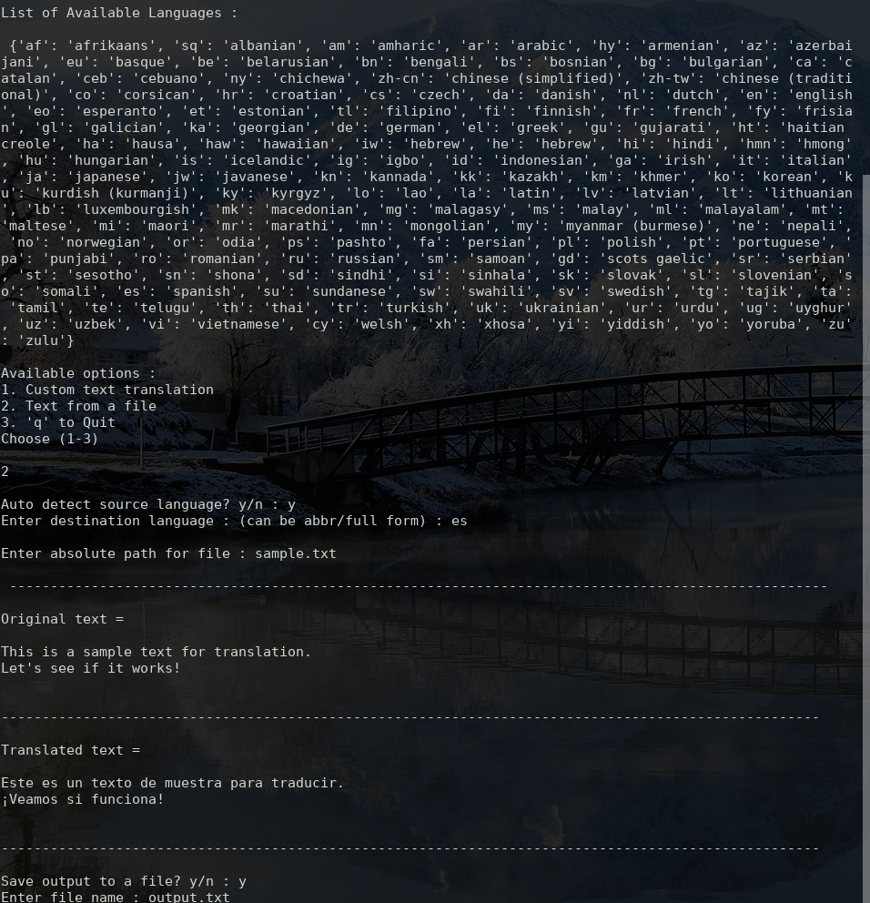

# Google-Py Translator
A simple python script to translate sentences/files using the G-Translate API 
If reading from a file, can also save the output 
Basic error handling has also been implemented

## Prerequisites
There is only one prerequisite, googletrans 
It can be installed by - 
`pip3 install googletrans`

## Usage
`python3 main.py`

## Screenshots

## Author name
#### Ritik Malik
