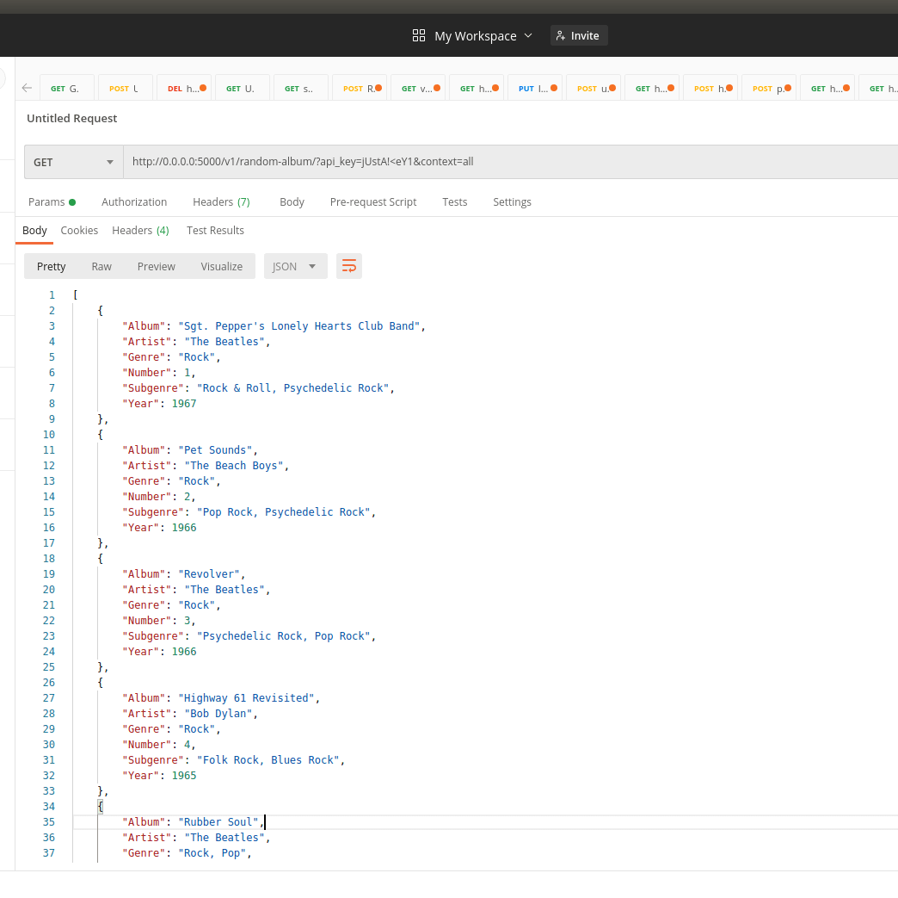
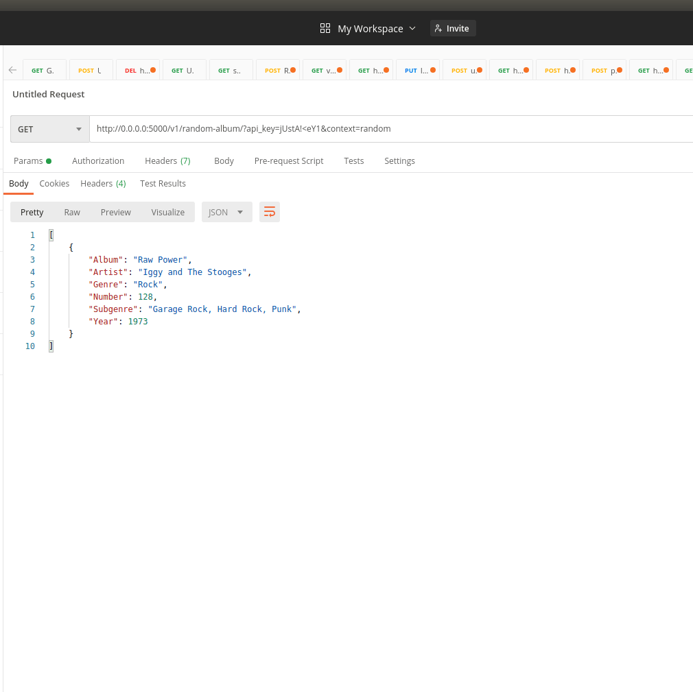
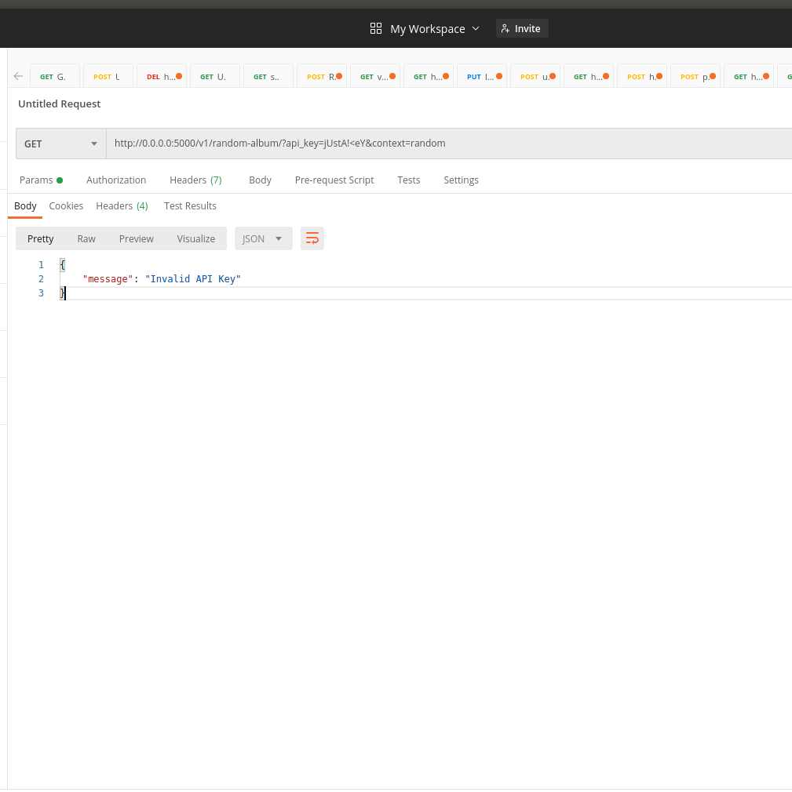

# Random Album Suggestion API
## An API to suggest a random album from Rolling Stone's 500 Greatest Albums of All Time dateset . It will either return a random album from list or all album from list depending upon the context sent with the request .

### Link of the same project hosted on Heroku(random album from list) : http://random-album.herokuapp.com/v1/random-album/?api_key=jUstA!%3CeY1&context=random 
### Link of the same project hosted on Heroku(all album from list) : http://random-album.herokuapp.com/v1/random-album/?api_key=jUstA!%3CeY1&context=all

## Setup Instructions

```
API Key : jUstA!<eY1

# Go to the root directoy of the project and install the requirements by typing :
  sudo pip3 install -r requirements.txt

# Start the server from root folder by typing :
  python3 -m Random_Album_API.run_server

# Access the endpoint by typing :
  http://0.0.0.0:5000/v1/random-album/?api_key=jUstA!%3CeY1&context=all (For all album in the list)
  http://0.0.0.0:5000/v1/random-album/?api_key=jUstA!%3CeY1&context=random (For a random album from the list)

```

## Folder Structure
```
Random_Album_API (Root)
├── Procfile    ->  contains commands that are executed by the app on startup on heroku
├── Random_Album_API 
│   ├── application.py -> The main app file
│   ├── application.pyc
│   ├── dataset -> Directory where dataset is stored 
│   │   ├── albumlist.csv
│   │   └── __init__.py
│   ├── __init__.py
│   ├── __init__.pyc
│   ├── logics  -> Directory where app logics are written
│   │   ├── app_logic.py
│   │   └── __init__.py
│   ├── run_server.py
│   ├── shared_resources -> Directory where shared resources  
│   │   ├── argument_check.py -> Decorator written to validate inputs
│   │   ├── exceptions.py     -> Exception Handling 
│   │   └── __init__.py
│   └── views             -> Directory where Class based view written to handle request and return response
│       ├── api_view.py   
│       └── __init__.py
├── readme.md
├── requirements.txt
├── runtime.txt
└── screenshots
    ├── all_albums-min.png
    ├── invalid_request-min.png
    └── random_album-min.png

```

## Exceptions 

```
 APIException : Raised when invalid api key(status_code=401) or context not in ('random', 'all')(status_code=406)
```


## Screenshot taken for all album call :

   

## Screenshot taken for random album call :

   

## Screenshot taken for invalid request
   
   

## Aim

The Aim behind this was to write a small flask project to showcase how we can structure our code using flask blueprint , writing class based view for a better organized code and handling exceptions .