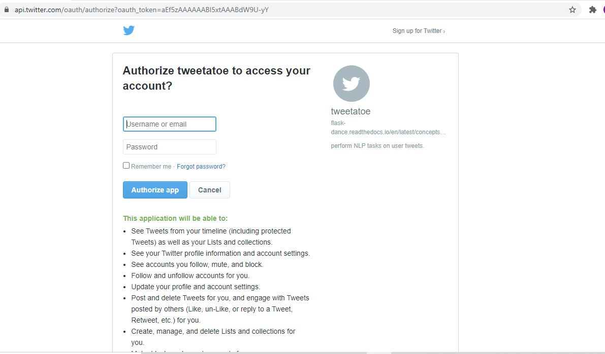
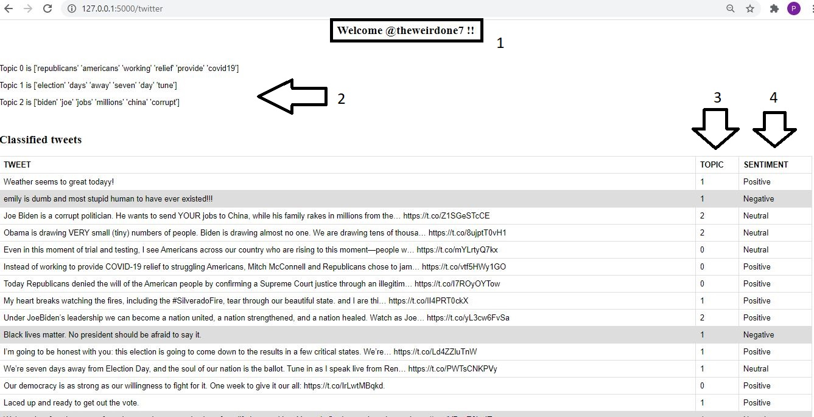

# Twitter Topic Modeling and Sentiment Analysis

A Flask web app with twitter OAuth for analysing user's tweet topics and its sentiments.

The user has to login using his/her twitter account details.

The application will retrieve user's tweets and apply an unsupervised clustering technique in NLP known as topic modeling to classify tweets into topics.The model used here is the Biterm topic modleing model know as BTM.BTM is most suitable model for small texts like tweets.

The application will also perform sentiment analysis using the vader sentiment analysis module.

## Prerequisites

* Clone the [BTM repo](https://github.com/markoarnauto/biterm) and copy-paste the biterm folder from there in the current folder.

* Create a twitter developer's account.

* Create an app from the [developer's home page](https://developer.twitter.com/en/apps)

* Mention the details for the app as shown, you can rename other fields but keep the callback url same.
```
Callback url : http://127.0.0.1:5000/login/twitter/authorized
```


* From this page go to "Keys and tokens" and copy your tokens and paste in the app.py file.
```
twitter_blueprint = make_twitter_blueprint(
    api_key= "<your_api_key>", api_secret= ""<your_api_secret>")
```

Website URL can be any random url.

* Install dependencies
```
pip install -r requirements.txt
```


## Usage
* In the main directory run the following command
```
python app.py
```
* You will get a url, go to that url.
In most cases it is this-
```
http://127.0.0.1:5000/ 
```

* The app is hosted!!

* Login using your twitter credentials



* Enter your profile display name/ID.

## Screenshots

* Final user dashboard



1. Your username/display name

2. Topics clustered by BTM

3. Each tweet classified into one of the 3 topics.

4. Vader Sentiment analysis for each tweet.

Each negative tweet is highlighted with grey background.

## Author name

Priya Mane
