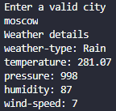

# Weather API script

Returns the weather of a valid city

### Prerequisites
Install requests
`pip install requests`

### Usage
1. Pull the file or copy the script into a file on your local machine.
2. Run the file.

### Output
