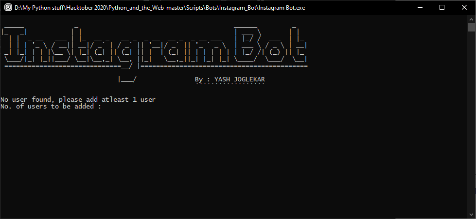
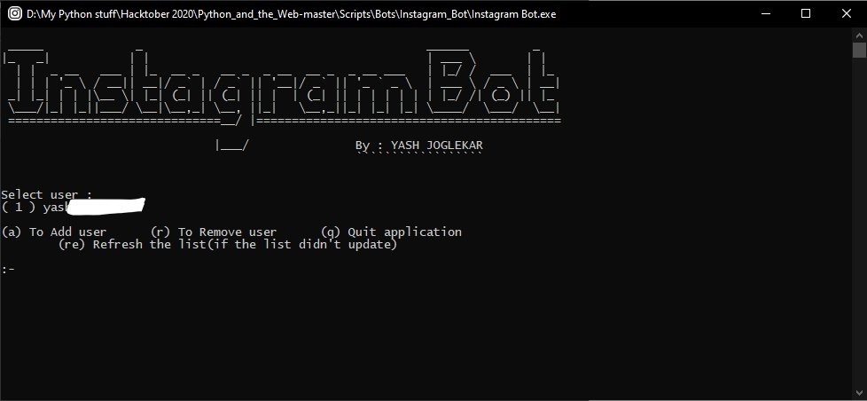
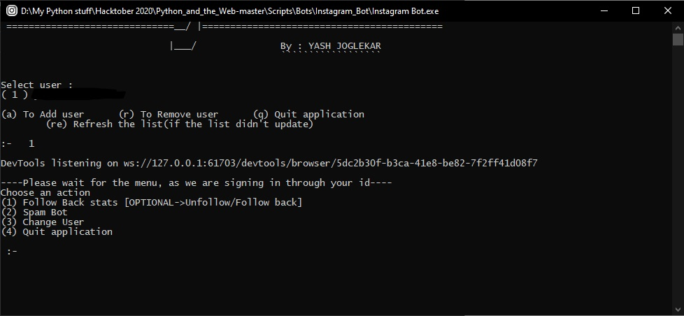
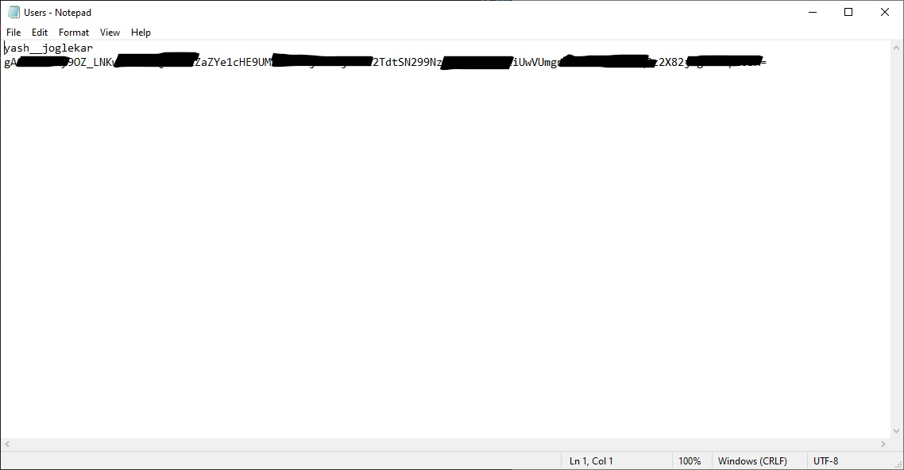

# Instagram Bot 
	
#### It can perform the followng task:

1. **Give list of people** :
	- Who don't follow you back 
		- _Optional-> Unfollow them all_
	- Whom you don't follow back 
		- _Optional-> Follow back them all_

2. **Spamming bot** :
	- It can spam multiple people in a single input with the custom message you provide

It saves your user id and password in the same location as your `.py`/`.exe` as `Users.txt`, and don't worry, your user id might be readable to you but password is in the encrypted form

It also saves boht of the list of the people in the form of simple text file.

For your convinience I created the executable file which functions the same and it doesn't even have any prerequisites except for the web driver

It waits for 50 seconds if you have second authorization enabled

## Prerequisites

**To run the `Instagram_bot.py` file you need following stuff in your system:**

1. [Python 3](https://www.python.org/downloads)

2. Following python pakages
    1. Selenium *{pip install selenium}*
    2. Cryptography *{pip install cryptography}*
    
    Or, simply run `pip3 install -r requirements.txt` in your command prompt in the same directory as your `Instagram_bot.py` file

3. Web driver of your respective browser
    - If you have Chrome installed in your system then download the [Chrome webdriver](https://chromedriver.chromium.org/downloads).
	- Place web driver and the bot in the same directory or else bot will fail.

**To run the `Instagram_bot.py` file you need following stuff in your system:**

1. You should have the `x64` bit OS.

2. Web driver of your respective browser
    - If you have Chrome installed in your system then download the [Chrome webdriver](https://chromedriver.chromium.org/downloads).
	- Place web driver and the bot in the same directory or else bot will fail.

## How to run the script

1. It'll ask you to select/add/remove instagram user id.
2. With your chosen id, now you can 
	- Keep a track on your followers/following
	- Spam multiple person
		
_Note:_
- Please make sure you opt the command/choice in form of numbers(1,2,3,4...), as the numbers will be mentioned in-front of the option_
- It is possible that in the 1st time use, your user id isn't shown even after adding it. In that case, just go for the option "Refresh(re)" or close and re-run the code/file.

### Screenshot/GIF showing the sample use of the script

#### When you open the app 1st time

#### After adding your username and password

#### Bot Commands available

#### Passwords stays safe(encrypted), even in your own computer

---------------------------------------

## *Author Name*

**Yash Joglekar**

GitHub username :- [YASHBRO](https://github.com/YASHBRO)
