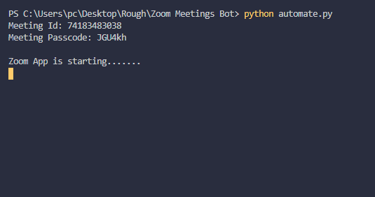
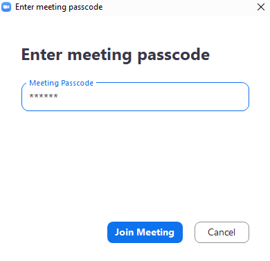
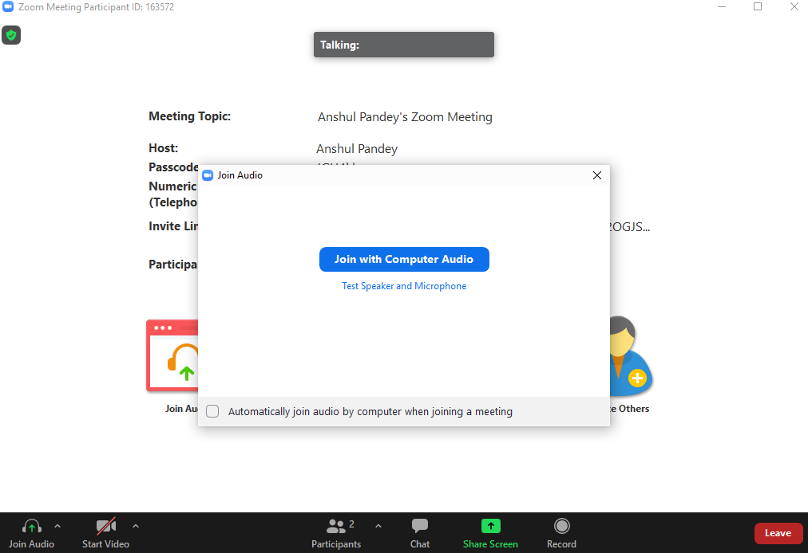

<h1 align=center>Zoom Meetings Automation</h1>

Python script that starts a zoom meeting - Meeting ID and Passcode are taken from the console. It joins the meeting automatically with camera and mic off.

## *Author Name*
[Anshul Pandey](https://github.com/Anshul275)

## Pre-Requisites

Run The Command  `pip install -r requirements.txt`

`1.` Python - 3 must be installed  
`2.` Zoom App must be installed  
`3.` Add the path of zoom app to the python-script  
`4.` No need to sign-in/sign-up to the app  
`5.` Only for initials - Type your name and choose Remember my name for future meetings  

## To Run the File

For Windows -  `python automate.py`

For Ubuntu/Linux - `python3 automate.py`

## Screenshots - 
`INFO` All the working screenshots are attached in "screenshots" directory
### Some Working Screenshots (Windows)

## 

## 

## 
