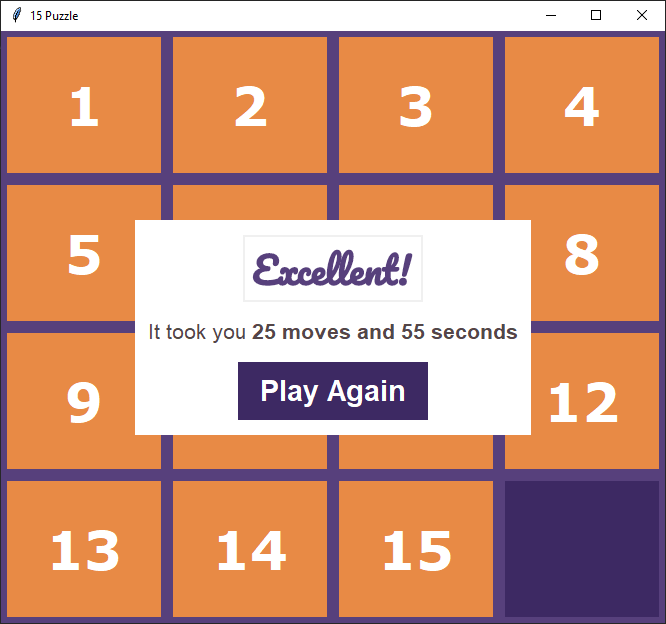

# 15Puzzle
The 15 puzzle is a sliding puzzle that consists of a frame of numbered square tiles in random order with one tile missing. The goal of the puzzle is to place the tiles in order by making sliding moves that use the empty space.

### How to run the script
copy this repo and cd into this directory
```
python 15puzzle.py
```

###



### Tips:
- To Move the Tiles you Can use your Arrow keys
- You can also click the Tiles to move them
- You can Press Escape key to reset your Grid

### How To Solve:
- Step-1: Solve 1,2,3,4
- Step-2: Solve 5,6,7,8
- Step-3: Solve 9 and 13
- Step-4: Solve 10 and 14
- Step-5: Solve 11, 12 and 15
- Step-6: There is no Step-6!

## *Author*
Made With ❤️ By Advik
https://github.com/ADV1K
