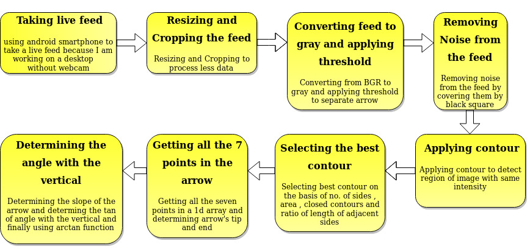

# Arrow Angle Detector

Takes live feed from the camera and prints the angle which the arrow is making with the vertical in real time.

# Prerequisites

Make sure you have OpenCV and numpy libraries.
Use 
```
pip install numpy
pip install opencv-python
```
# How to run the script

Run the file like a normal python file.

# Demo

Flow chart gives a brief idea about how the project was made.



## Demo image


