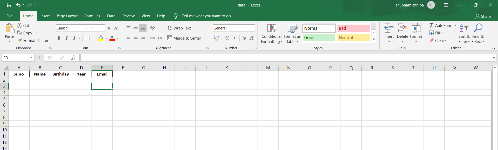
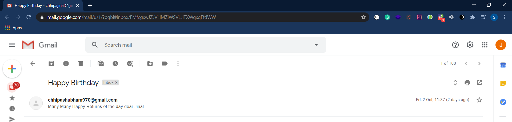

>Are you bored with sending birthday wishes to your friends or do you forget to send wishes to your friends or do you want to wish them at 12 AM but you always fall asleep?
>Why not automate this simple task by writing a Python script

Steps:

  1.Create an Excel sheet for containing records like this: Name, Email, Contact, Birthday, and Year.
  
  
  2.Add Path to your excel sheet in main.py script.
  
  3.Add your gmail credentials.
  
  4.Run main.py script.
  

>Now lets schedule our scripts to run everyday at 12:00 AM.

  1.You can schedule script using task scheduler in your machine.
  
  2.Limitation of this approach  is that script will run when yor machine is on and if supposed your machine is off at 12:00 AM then it will run script when your machine starts on next day.
  
  >So what to do next?
  
  The next approach is as follows which won't require to turn on your machine.
  
  1.Deploy your python script to Heroku.
  
  2.Now you can schedule script on heroku using Advance Scheduler.
  
  You can read the docs of how to shedule your script using Heroku : https://medium.com/analytics-vidhya/schedule-a-python-script-on-heroku-a978b2f91ca8 .
