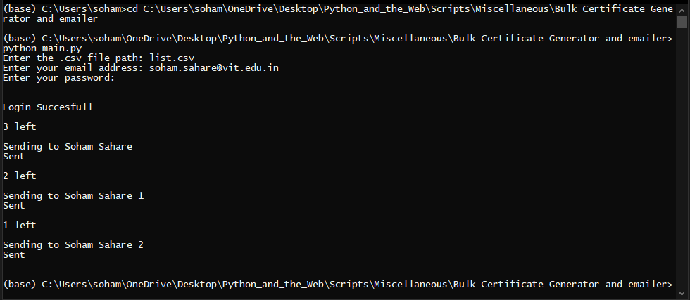
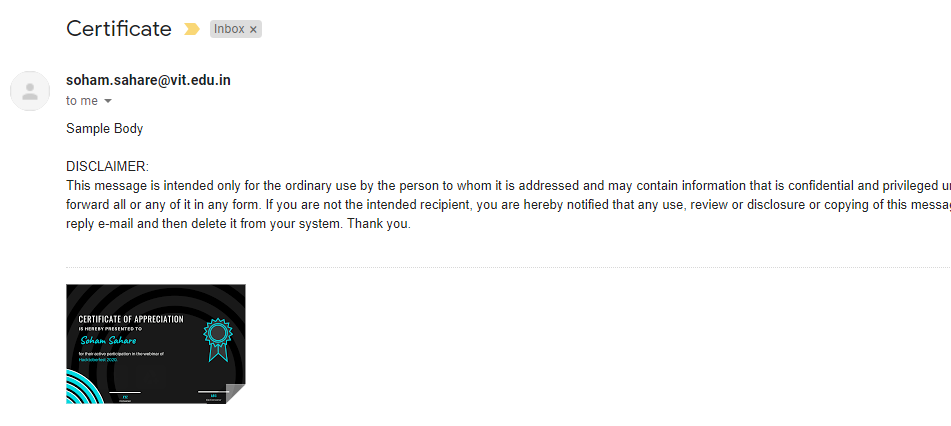

# Bulk_Certificate_Generator_ande_mailer
A python script to generate bulk certificates and email them to their respective email id by using a .csv file

## Requirements
```
pip install -r requirements.txt
```

```
File should be a .csv
Email should be an outlook email if you want to use other account you can go to main.py line 27 and change it accordingly.
Email subject and Email body can be changed on line 40 and 42 respectively.
 ```

## How to run the script
```
python main.py
```

### Screenshot/GIF showing the sample use of the script

Running Code:
<br>

Delievered mail:
<br>

## Author Name
<a href="https://github.com/sohamsahare123">Soham Sahare</a>
