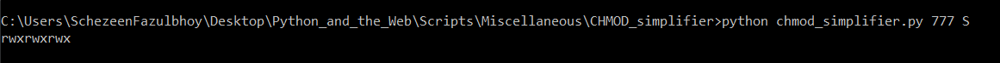
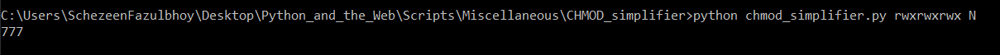

## Python CHMOD Simplifier

### What is CHMOD?
'CHMOD' is a command used in Unix based systems that is used to change access permissions of files and directories. It is an abbreviation for 'Change Mode.'

The CHMOD numerical format is composed of 3 digits, each ranging between 0 and 7. From left to right, each digit represents the corresponding permissions for _user_, _group_ and _other_ respectively.

Each of these digits represents a binary value which controls the _read_, _write_ and _execute_ permissions pertaining to that group. A value of 1 indicates that the corresponding group is allowed an action, where as 0 indicates that the action is not allowed.

Thus, each digit can be represented as r (read), w (write) and x (execute) symbolically based on the binary value of the indicating digit.

For example, the chmod permission 755 can we interpreted as follows:

| NUMBER | CLASS  | BINARY | PERMISSION           | rwx |
|--------|--------|--------|----------------------|-----|
| 7      | USER   | 111    | read, write, execute | rwx |
| 5      | GROUP  | 101    | read, execute        | r-x |
| 5      | OTHERS | 101    | read, execute        | r-x |

Thus, 755 in the numerical format would translate to  rwxr-xr-x.

### This script converts symbolic representation of CHMOD permissions to it's numerical equivalent, and the Numerical representation of CHMOD permissions to its Symbolic equivalent as well.
Example (numerical to symbolic representation):
input: 777
output: rwxrwxrwx

[Symbolic Representation](./SymbolicNotation.PNG)

Example (symbolic to numerical representation):
input: rwxrwxrwx
output: 777

[Numerical Representation](./NumericalNotation.PNG)

### How to use this script?

1. The script has 2 options:
- Symbolic to Numerical (N)
- Numerical to Symbolic (S)

Pass the desired mode of conversion while executing the script

2. Run the following command:
    python chmod_simplifier.py <representation> <mode>
    
    Replace: 
        - <representation> with 777 or rwxrwxrwx based on your preferred mode of conversion
        - <mode> with either 'S' or 'N' as per the desired mode

3. View output on console

### Author

[Schezeen Fazulbhoy](https://github.com/schezfaz)