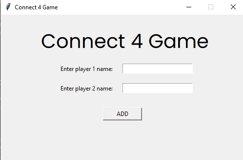
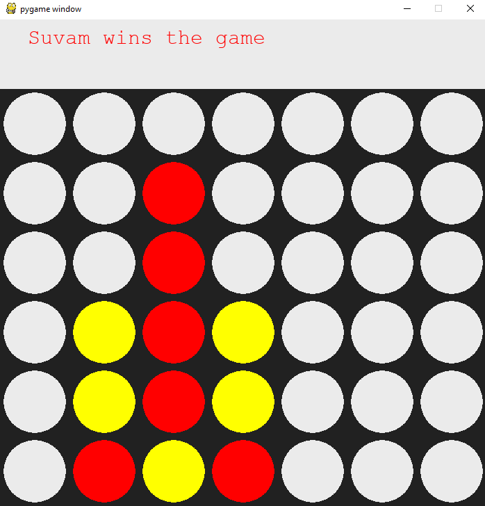

# Connect 4 Game

:heart_eyes: **Connect Four** (also known as **Four Up**, **Plot Four**, **Find Four**, **Four in a Row**, **Four in a Line**, **Drop Four**, and **Gravitrips** in the Soviet Union) is a two-player connection board game , in which the players choose a color and then take turns dropping colored discs into a seven-column, six-row vertically suspended grid. The pieces fall straight down, occupying the lowest available space within the column. The objective of the game is to be the first to form a horizontal, vertical, or diagonal line of four of one's own discs. Connect Four is a "Solved game". The first player can always win by playing the right moves.

The game was first sold under the _Connect Four_ trademark by "Milton Bradley Company") in February 1974.

## How To Play the Game ?

:exclamation: **NOTE:** Play this game along with your friends

    python3 connect4game.py

## ScreenShots

## Creator

:heart: Suvam Prasad
