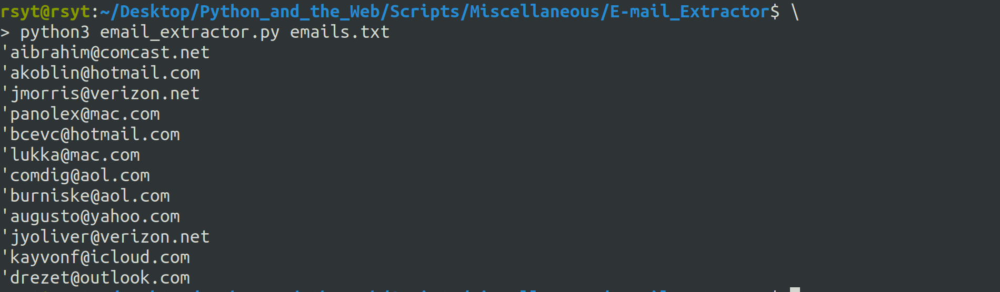

# Email-Extractor

This Simple Scripts extract the email from text files and static webpages

## Prerequisites

Install the required packages

`pip install -r requirements.txt`

## How to use this script?

### For Text Files

```python email_extractor.py text_file.txt```

### For Webpages

```python email_extractor.py <url>```

## Screenshot



## Author

[YOGESHWARAN R]("https://github.com/yogeshwaran01/")
