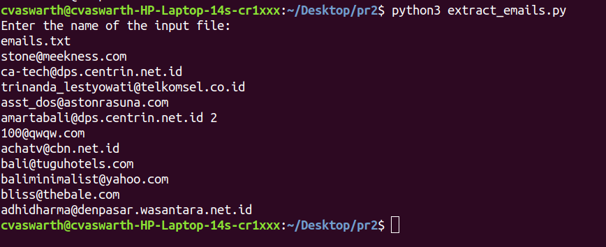

# Email extractor
A simple Python script that extracts and finds out valid emails from a given file.

### Prerequisites
Python 2 / Python 3

### To execute the script

```python3 extract_emails.py```

### Screenshot of succesful execution for python3

### Screenshot of succesful execution for python2


## *Author Name*
C V Aswartha Narayana
