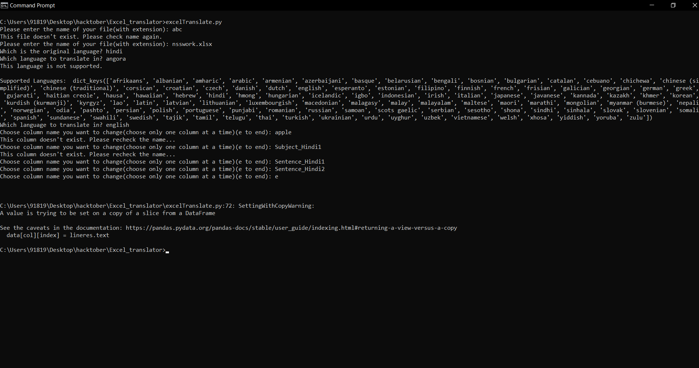
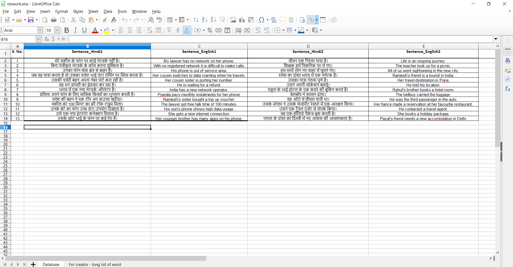
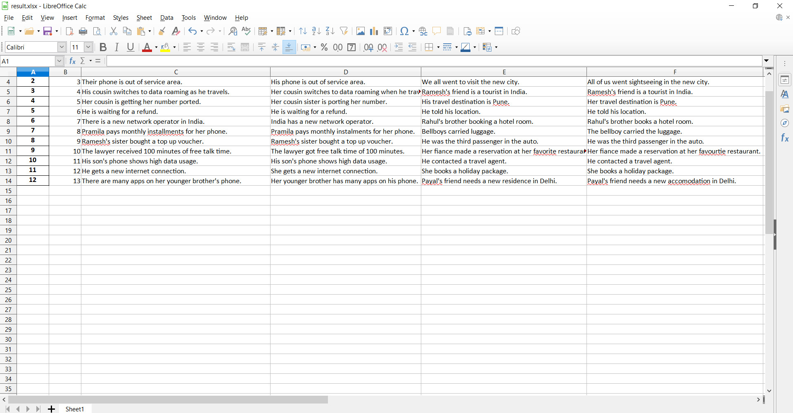

> Developed by: [Sahil Bairagi](http://Sahil-k1509.github.io)

## Excel Translator

**How to run**
1) Install all the modules mentioned in requirements.txt
2) Run excelTranslate.py
3) Program will prompt you to enter all the details and check for errors(wrong file name, column name, invalid language etc).

**About the program**
You can use this program as a quick translator for your excel files, if 
you want to translate a lot of rows in as small time as possible.
(Note: For big files, the execution might be bit slow, but still much faster than manual translation. If any error occured while translating the program will stop at that moment and write the present translated rows in the excel. rest rows will be copied as it is.)

_Code running:_

_Original file_

_translated file_
