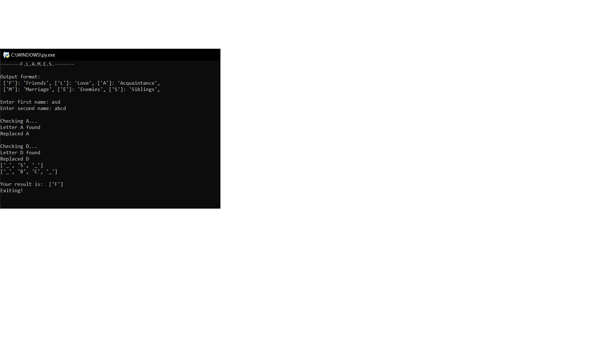
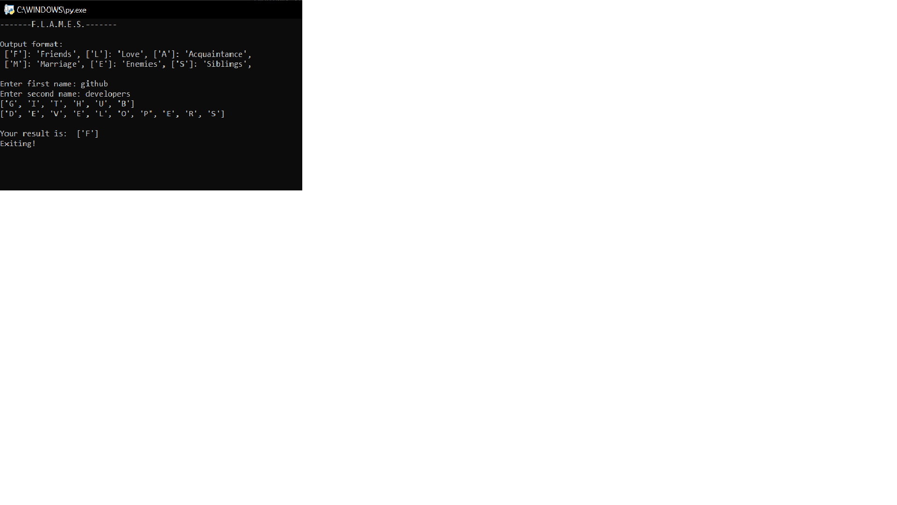

# FLAMES game
A simple Python script to implement the FLAMES game we all might have played in our childhood.

### Prerequisites
Python 2 / Python 3

### How to run the script
First move to the `FLAMES-game` directory to access the files
Run the following command once you are in the `FLAMES-game` directory:

```cd Scripts/Miscellaneous/FLAMES-game```

Now, to run the scripts, use the following commands:

For Python 3: ```python3 flames_game.py``` <br>
For Python 2: ```python flames_game.py```

### Screenshot/GIF showing the sample use of the script



## *Author Name*
Saujanya Pandey