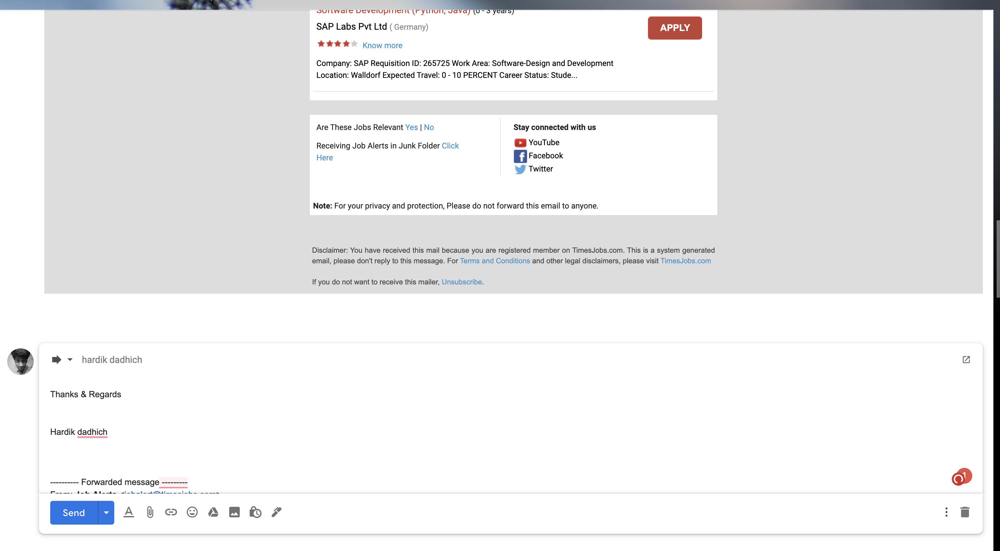

# Script Title

<!--Remove the below lines and add yours -->

A Python script that automate opening of gmail using your Credentials and sends mails to sender.

### Prerequisites

<!--Remove the below lines and add yours -->

Modules required to be able to use the script successfully and how to install them.
`pip install -r requirements.txt`

### How to run the script

<!--Remove the below lines and add yours -->

```bash
    cd Scripts/Miscellaneous/Gmail_Automation_using_selenium/
```

1. create details.ini file by `vi details.ini`

2. paste these following details in `details.ini` and replace values.

   ```
    [login_details]
    username_for_email=<your email_add>
    password_for_email=<your password>
    sending_email_add=<senders email addres>
    driverpath=<chrome driver path of your machine>
    url_path=https://mail.google.com/mail/u/0/#inbox
   ```

3. Then run:
   `python gmail_automation.py`

### Screenshot/GIF showing the sample use of the script



## _Author Name_

[Hardik_Dadhich](https://github.com/hardik-dadhich)
