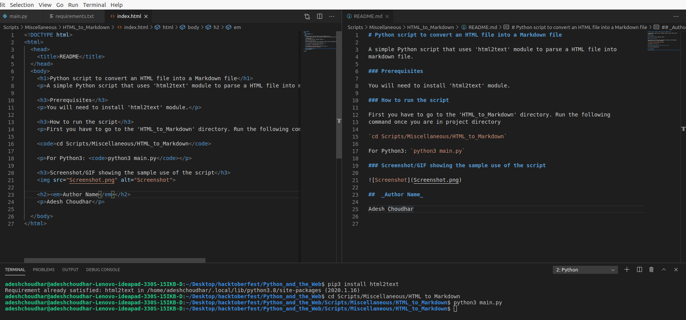

# Python script to convert an HTML file into a Markdown file

A simple Python script that uses 'html2text' module to parse a HTML file into
markdown file.

### Prerequisites

You will need to install 'html2text' module.

### How to run the script

First you have to go to the 'HTML_to_Markdown' directory. Run the following
command once you are in project directory

`cd Scripts/Miscellaneous/HTML_to_Markdown`

For Python3: `python3 main.py`

### Screenshot/GIF showing the sample use of the script

##  _Author Name_

Adesh Choudhar

