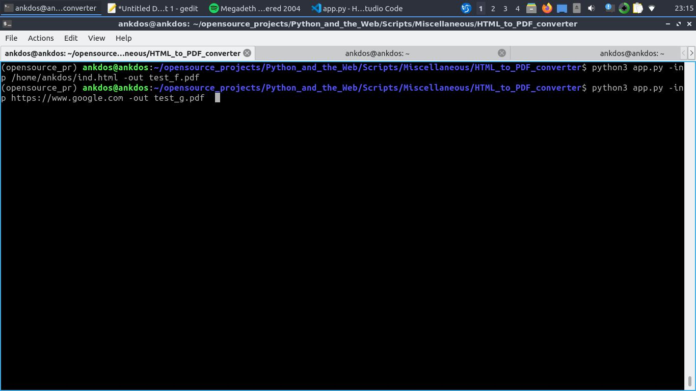
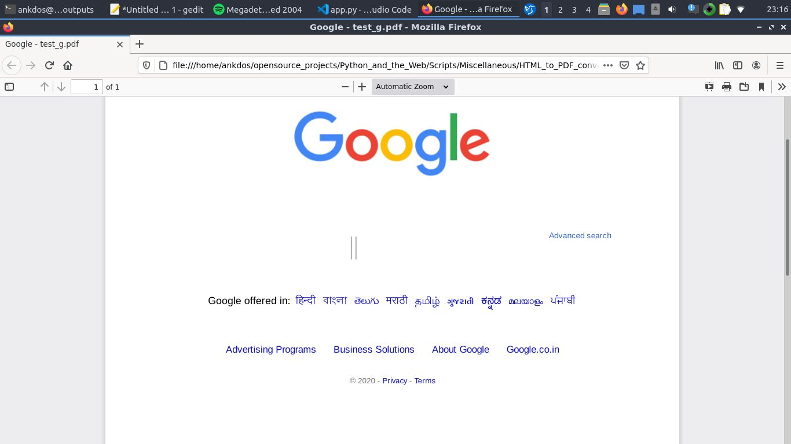

# HTML to PDF Converter
## A python script to convert HTML to PDF by entering input file url / website url and output file name of the pdf as arg

## Setup Instructions

```

# Go to the root directoy of the project and install the requirements by typing :
  sudo pip3 install -r requirements.txt

# Run the script  by typing :
  python3 app.py -inp <file url/ web url> -out <output file name>

  Example (For web) : 
  python3 app.py -inp https://www.google.com -out test_g.pdf
  
  Example (For local HTML file):
  python3 app.py -inp /home/ankdos/ind.html -out test_f.pdf

# The output file will be stored in the ./outputs folder

# NOTE : If you face the problem of "parse() got an unexpected keyword argument 'override_encoding' " , then upgrade your html5lib by typing :
  
  pip3 install --upgrade html5lib 

```

## Screenshot taken of cli command :

   

## Screenshot of the pdf output :

   


### Author

[Ankur Pandey](https://github.com/ankdos)