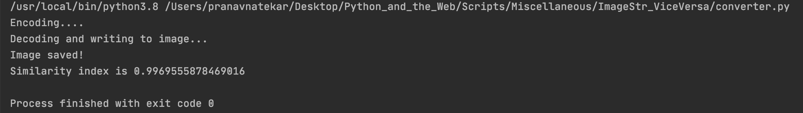

# Python script that converts Image to base64 encoding and vice versa.


### Prerequisites
* Required modules: 
 ```base64```,  ```PIL```, ```skimage``` and ```cv2```
* The ```base64``` is an inbuilt module.
* Install ```PIL``` by running ```pip install Pillow```.
* Install ```skimage``` by running ```pip install scikit-image```.
* Install OpenCV by running ```pip install opencv-python```.


### How to run the script
First you need to go to the ImageStr_ViceVersa directory.

```cd Scripts/Miscellaneous/ImageStr_ViceVersa```
* Select the image from your PC by providing its path to ```im_path``` variable.

And then run the following command once you are in project directory.

```python3 ImageStr_ViceVersa.py```


### Screenshot




## *Author Name*
Pranav Natekar