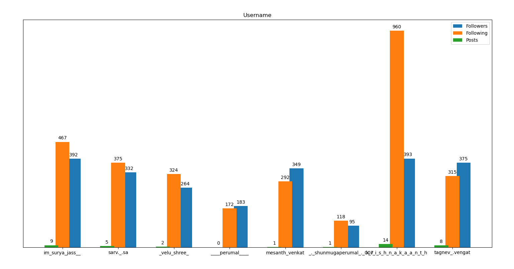

# Instagram Analyzer

This Scripts analyze the Instagram user data like Followers, Followings and Posts with Matplotlib
bar charts.

## Prerequisites

Install the required packages

`pip install -r requirements.txt`

## How to use this script?

1.Make a text file of list of Instagram username. For example
   `user.txt` contains

```
github
pubg
facebook
iplt20
chennaiipl
google
```

2.Run the script

```python instagram_analyzer.py user.txt```

## Screenshot

## Author

[YOGESHWARAN R]("https://github.com/yogeshwaran01/)
