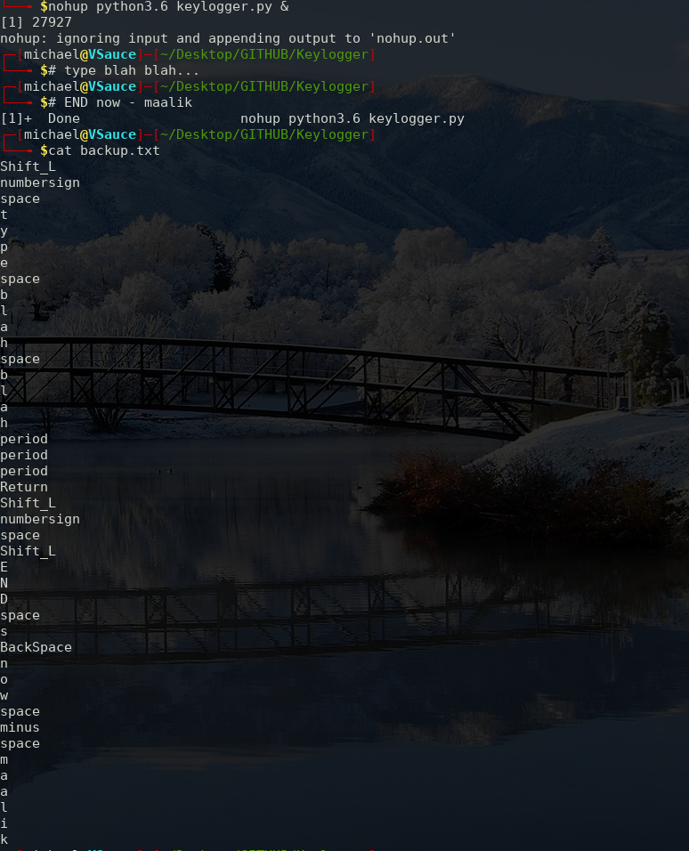

# Keylogger
A keylogger that - 
1. Captures your input in any window
2. Save them to a file
3. Quits automatically on an exit signal
4. Saves load on CPU when special keys are pressed 

## Prerequisites
Pyxhook -> 
`pip3 install pyxhook` 
Python-xlib -> 
`pip3 install python-xlib` 

## Usage
Before running the program, set the <b>END SIGNAL</b> & <b>LOG FILE</b> path in line number 11 & 12 in keylogger.py 
Then you can either run it with -> 
`python3 keylogger.py` 
Or if you want it in background -> 
`nohup python3 keylogger.py` 
 
The temporary buffer is reset everytime, if it doesn't matches the end signal 
The script goes to sleep for 1 second when a special key is pressed (to reduce load on CPU)

## Screenshots

## Author name
#### Ritik Malik

