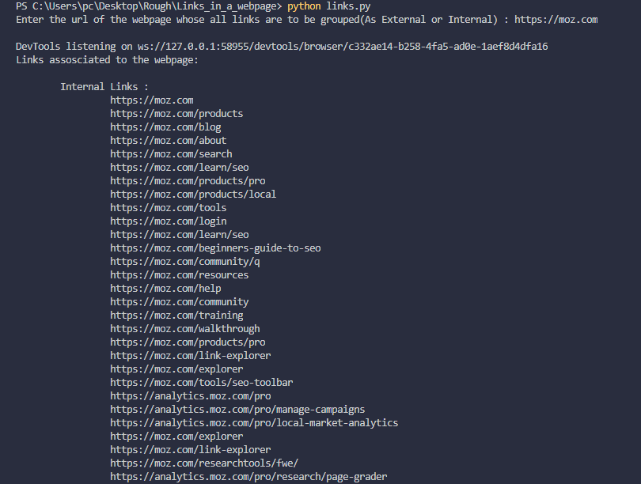
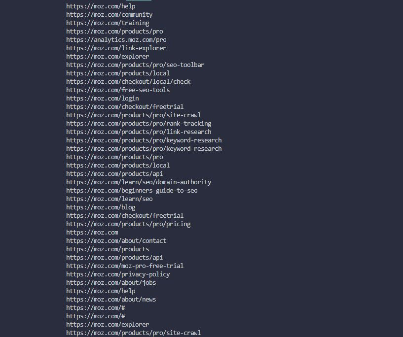
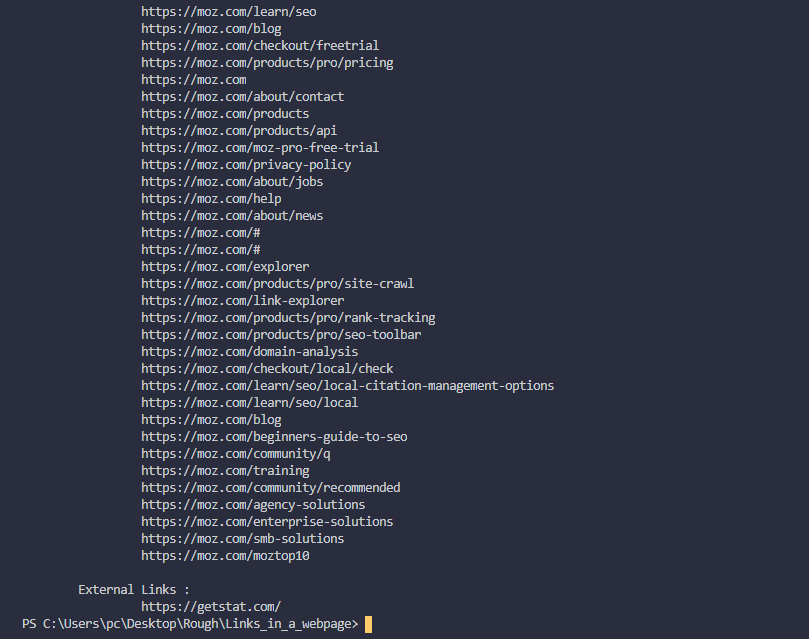

<h1 align=center>Links - Internal or External</h1>

Scrapes and finds all the links in a webpage and categorise them as external or internal links  
`The Grouped links on the basis of category are printed on the console`

## *Author Name*
[Anshul Pandey](https://github.com/Anshul275)

## Pre-Requisites

Run The Command  `pip install -r requirements.txt`

### To install the chrome web-driver:
`1.` Check the chrome-version you are currently using `chrome://settings/help`  
`2.` Download the desired Chrome web-driver for your version `https://chromedriver.chromium.org/downloads` and extract the zip file
  
`IMP` - Add the full path of the `chromedriver.exe` file in `driver_path` variable of `links.py` file

## To Run the File

For Windows -  `python links.py`

For Ubuntu/Linux - `python3 links.py`

## Screenshots - 

### Working Screenshots

