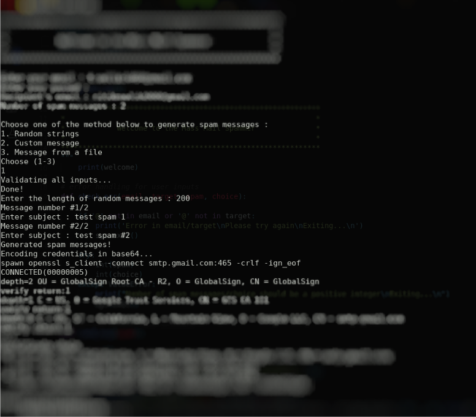
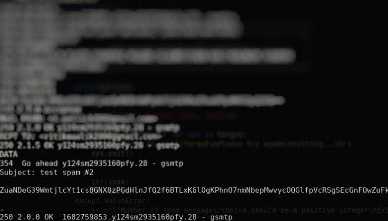

# Mass Mail Spammer
A python + expect script to send any number of trash emails from your google account, with custom/random trash messages (can also be taken from a file) to any target. 
The connection is made via secure openssl to GSMTP. Google accepts the credentials in base64 and TLS connection 
<b>Make sure that use have enabled less secure app access in your google account</b> 
There are 3 options to send the messages : 
1. Random Messages 
2. Custom user defined 
3. From a files 
Basic error handling has also been done 

## Prerequisites
Expect 
// On Debian based systems 
`sudo apt install expect` 

// On Redhat based systems 
`sudo yum install expect` 

## Usage
`python3 main.py` 
<b>Also, the passwd field will remain empty when you type your gmail passwd</b> 
(as a matter of privacy)

## Screenshots
The screenshots are blurred to hide the sensitive info 
  
 
 

## Author name
#### Ritik Malik

