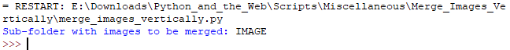

# Merge Images Vertically
Merge images inside a subfolder vertically using Pillow.  
Useful for comics and webtoons.

### Pre-requisites:
You will need to install python on your machine. You can download python from the python.org and install it.  
Run `pip install -r requirements.txt` to install modules used.

### How to run the script
Run `python merge_images_vertically.py`.  
Type in the subfolder name in which the images are saved.

### Screenshot of the console interaction

## *Author Name*

[João Camelo](https://github.com/jrcamelo)