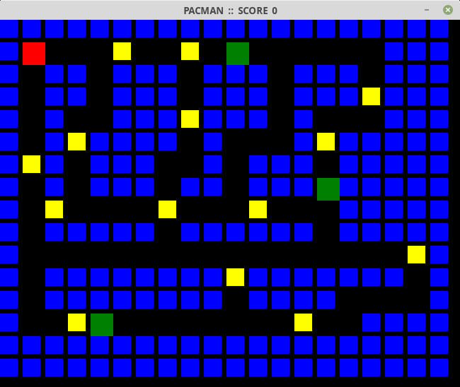

# Pac-man
A simple implemtation of Pac-man using pygame 

## Prerequisites
Pygame - `pip3 install pygame`  
Numpy  - `pip3 install numpy`

## Usage
To start the game - `python pacman.py`  
The game has 2 levels, 1: easy & 2: hard 
The levels are differentiated on the basis of speed of the enemy 
The aim is to dodge the enemies & collect all the coins 
The game ends if user encounters an enemy or if all the coins are collected 

## Customization
* You can change the starting position/number of enemies/palyers & coins by editing the `layout.txt` file 
> w = Wall 
> . = Empty cell  
> c = coin  
* You can add your own background music 
Just add a new music file & change it's name in the 9th line of `pacman.py`

## Screenshot

## Author Name
> Ritik Malik
