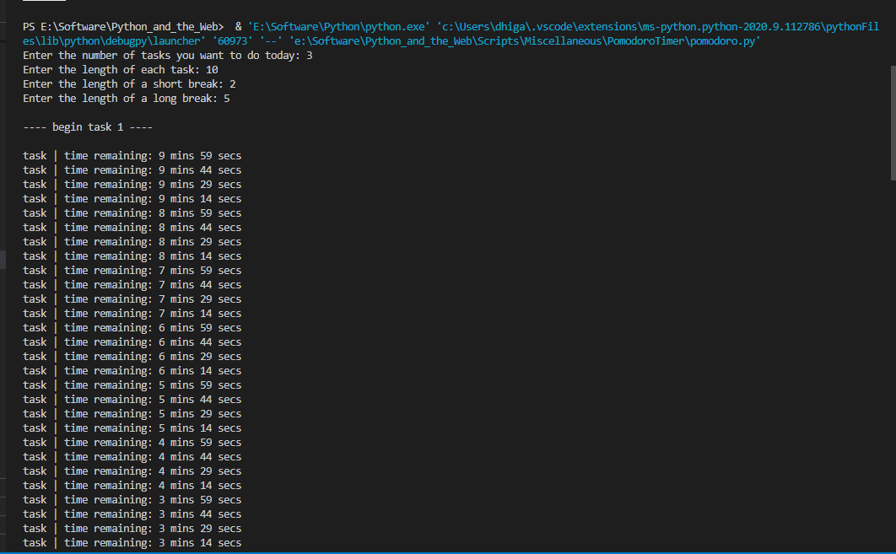
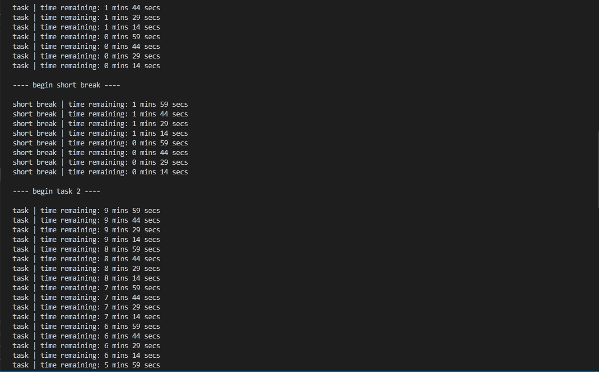
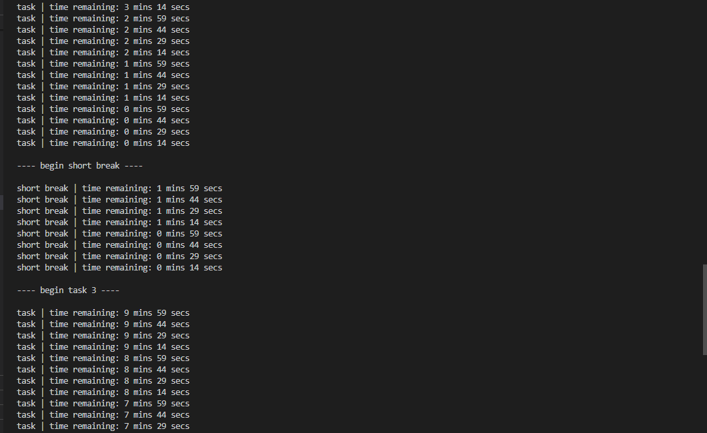
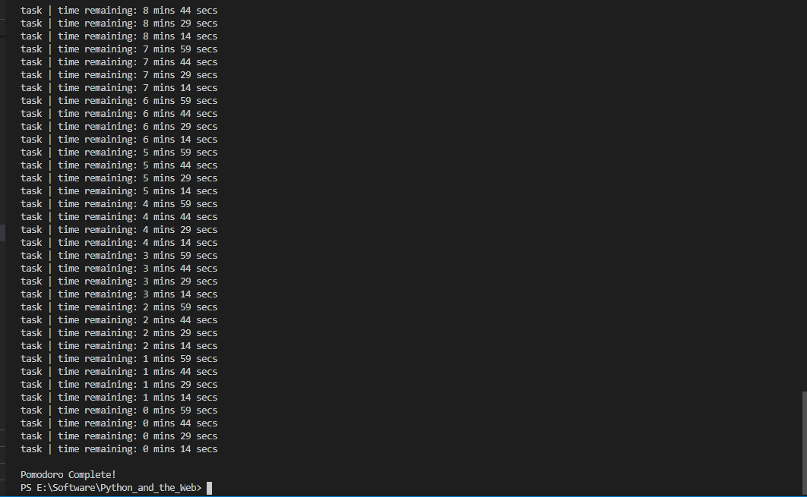

# Pomodoro Timer using Python

This is a simple Python script which helps you organize your work into chunks of time whose length can be user-defined. It tells you to take short breaks between your tasks so you become more productive.

## Prerequisites

There are no external dependancies. This script makes use of the `datetime` library which is included in the Python installation.

## How you can run the script

Simply type `python main.py` in your terminal.

## Screenshots showing the Script in action

## Author

This script was made by [Dhiganth Rao.](https://github.com/dhiganthrao)
