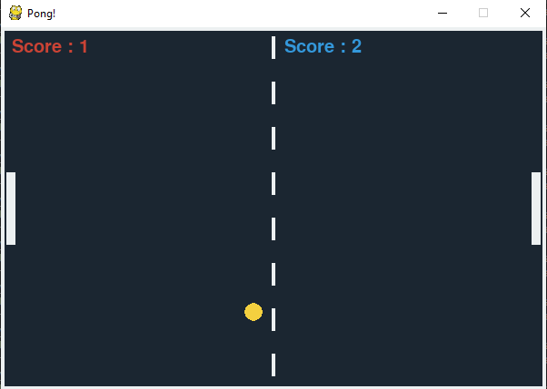

# Pong Game

Pong Game built using Pygame!

## Prerequisites

Install the required packages

`pip install -r requirements.txt`

## How to play?

1. Install [Python 3](https://www.python.org/)
2. Run the script.
3. Player 1 will use W, A, S, D to play, Player 2 will use the arrow keys.

## Screenshot

## Author

[Vyprath](https://github.com/Vyprath)
