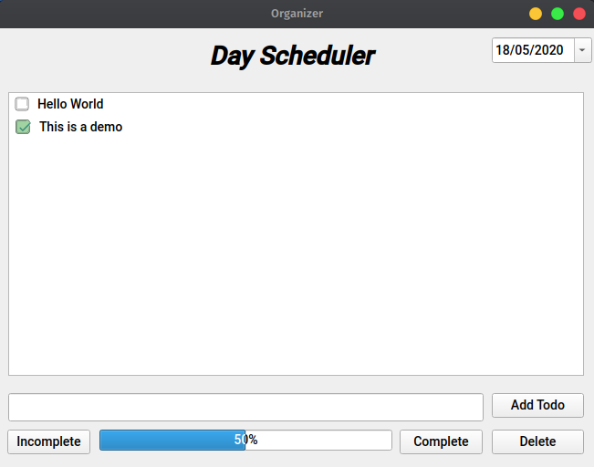

# Organiser application
  This application was built with the PyQt5 Python

    - Add plans to your day
    - Organise your day
    - Keep track abouts all meetings and todos

  
# Installing

  `pip install -r requirements.txt`
  
# How to run the script
  `python main.py`

# Screenshot
 

## *Author Name*

[Swaroop Maddu](https://github.com/swaroopmaddu)
