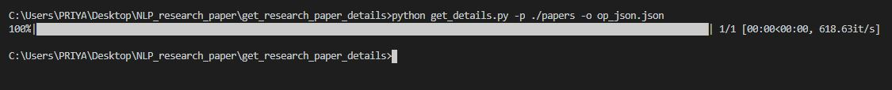

# Research paper parser

The script reads latex files for research paper from the given directory and extracts essential information from the latex format.

The script purges unwanted items like -
* Images
* Tables
* Equations

The script returns a json object containing following items for each research paper - 
* title
* author
* abstract
* introduction
* conclusions
* results
* acknowledgments
* Scrapes any other title defined by the user too.

***
### Prerequisites

```
pip install -r requirements.txt
```

***

### How to run the script

```
python get_details.py -p <directory_containing_papers> -o <output_file_path>
```

Example :

```
python get_details.py -p ./papers -o op_json.json
```



***


### Results

A sample json object created for one research paper.

```
 {
        "author": "I.M. Great and So.R. Yu",
        "title": "A Sample Research Paper",
        "Introduction": " \n\nUsing latex is pretty easy if you have a sample document you can follow.Lorem ipsum dolor sit amet, consectetur adipiscing elit. Sed volutpat ornare odio et faucibus. Donec fringilla massa eget auctor viverra. Mauris a imperdiet est. Cras tincidunt nulla ut elit tristique ultricies. Phasellus nec orci vel mi suscipit maximus at vitae tortor. Vivamus sed libero vel lacus aliquam rhoncus. Ut in lacinia nunc. Nullam quis mauris leo. Phasellus vitae nisl condimentum quam congue volutpat. Quisque et dapibus ipsum. Curabitur fringilla pellentesque elit, non posuere purus malesuada id. Pellentesque rutrum vitae urna eu mattis.\n\nMaecenas ac congue massa. Quisque a sem turpis. Duis et diam ex. Suspendisse et enim interdum, sodales risus eu, ultrices est. Suspendisse eu odio enim. In vulputate odio porttitor tincidunt vestibulum. Praesent tincidunt ullamcorper purus, quis semper felis volutpat quis.\n\n",
        "Results": " \nIncluding figures, tables, and equations is easy. Latex also permits easy reference to document elements (figures, tables, sections). Lorem ipsum dolor sit amet, consectetur adipiscing elit. Aliquam tincidunt lorem luctus eros dictum faucibus. Fusce euismod libero et erat pretium dapibus. Pellentesque faucibus hendrerit est, ac fringilla urna. In porta, ante eu dictum vestibulum, nisl nulla euismod purus, ac bibendum nibh ante vel elit. Fusce diam ante, tincidunt id eleifend a, hendrerit vitae tellus. Duis pretium urna ac vestibulum eleifend. Suspendisse potenti. Aliquam varius odio in pretium semper. Ut faucibus lobortis mauris vel sollicitudin. Nullam condimentum, lacus quis mattis pellentesque, massa nulla cursus nisi, aliquet eleifend est tellus ut libero.\n\n \n\n \n\n \n\n",
        "Conclusions": " \n\nMan, latex is great! Lorem ipsum dolor sit amet, consectetur adipiscing elit. Aliquam tincidunt lorem luctus eros dictum faucibus. Fusce euismod libero et erat pretium dapibus. Pellentesque faucibus hendrerit est, ac fringilla urna. In porta, ante eu dictum vestibulum, nisl nulla euismod purus, ac bibendum nibh ante vel elit. Fusce diam ante, tincidunt id eleifend a, hendrerit vitae tellus. Duis pretium urna ac vestibulum eleifend. Suspendisse potenti. Aliquam varius odio in pretium semper. Ut faucibus lobortis mauris vel sollicitudin. Nullam condimentum, lacus quis mattis pellentesque, massa nulla cursus nisi, aliquet eleifend est tellus ut libero.\n\n",
        "Some_title": " \n\nTest title for user defined  section.\n\n",
        "user_defined_title_for_begin": " \n\nwjlrhfwer ljqr flwuer j rlferfurl u airlf  aiurf uoiruf iuoqir oiuqr iuq woe\n",
        "acknowledgement": "\nThe author is grateful to Donald Knuth for inventing tex, and making publication quality typesetting a reality for scientists around the world.\n\n"
    }
```


***

## *Author Name*

Priya Mane

***


