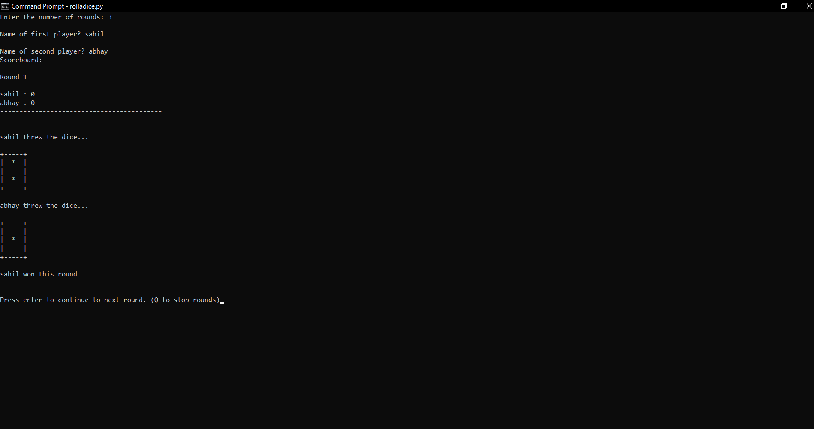
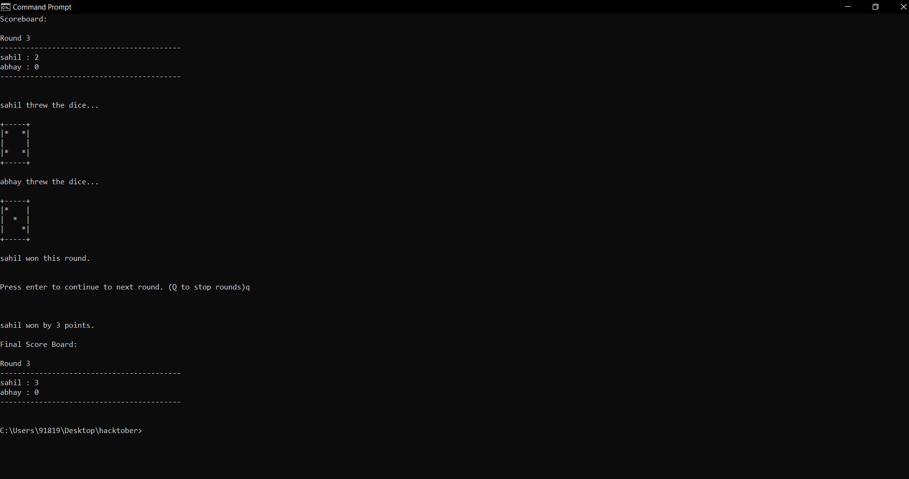

> **Developer:** [Sahil Bairagi](http://Sahil-k1509.github.io)  

### How to play
0. Your System must have [python installed](https://www.python.org/) (python 3).
1. Run the game. No need to install any other modules.

### About the Game
- In Roll-a-dice, You play against a person.
- Both of you throw a dice and the person with highest number on top wins that round and gets 1 point.
- In case of draw, both gets 0 points.
- Game is repeated for n number of rounds.
- Person who wins maximum number of rounds win the game.

