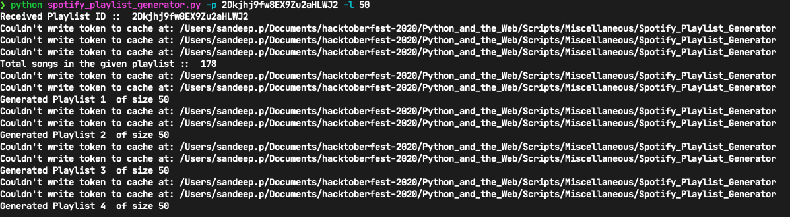

# Script Title
<!--Remove the below lines and add yours -->
Spotify Playlist Generator

### Prerequisites
<!--Remove the below lines and add yours -->
1. Spotipy 
` pip install spotipy --upgrade `

### How to run the script
<!--Remove the below lines and add yours -->
1. [Create Spotify Developers Account and create a new app](https://developer.spotify.com/)
2. Export Client Id, Client Secret and Redirect URI
    * `export SPOTIPY_CLIENT_ID='your-spotify-client-id'`
    * `export SPOTIPY_CLIENT_SECRET='your-spotify-client-secret'`
    * `export SPOTIPY_REDIRECT_URI='your-app-redirect-url'`
3. `python main.py -p [playlist_id] -l [size_of_each_playlist]`

### Screenshot/GIF showing the sample use of the script
<!--Remove the below lines and add yours -->

## *Author Name*
<!--Remove the below lines and add yours -->
Sandeep Jaiswal
