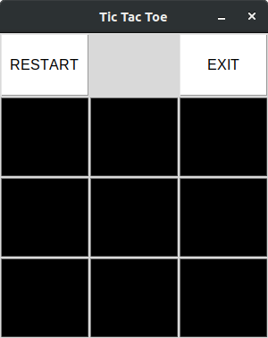
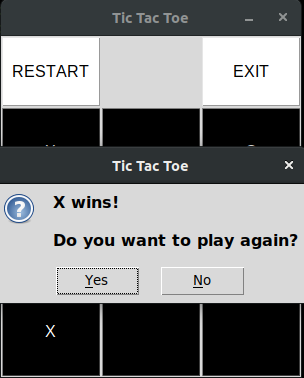

#   TIC TAC TOE #

A simple tic tac toe game made in python.

## Introduction ##

A tic tac toe is a game in which two players seek in alternate turns to complete a row, a column, or a diagonal with either three O's or three X's drawn in the spaces of a grid of nine squares; noughts and crosses. I've tried making this in python using `tkinter`

## Usage ##
```
$ python3 main.py
```

## Examples ##





## Author name
<a href="https://github.com/madhavmehndiratta">Madhav Mehndiratta</a>
