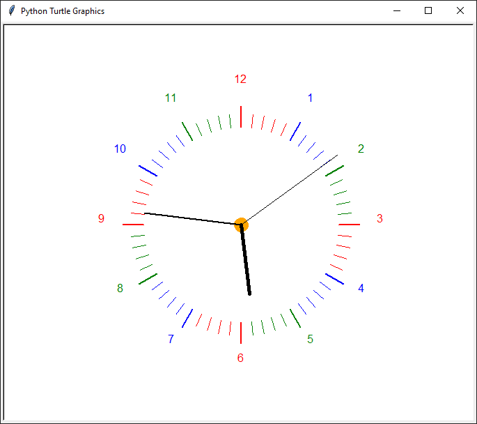

# TurtleClock
A simple Analog Clock Made with Python Turtle

### How to run the script
copy this repo and cd into this directory
```
python TurtleClock.py
```

###


## *Author*
Made With ❤️ By [Advik](https://github.com/ADV1K)
