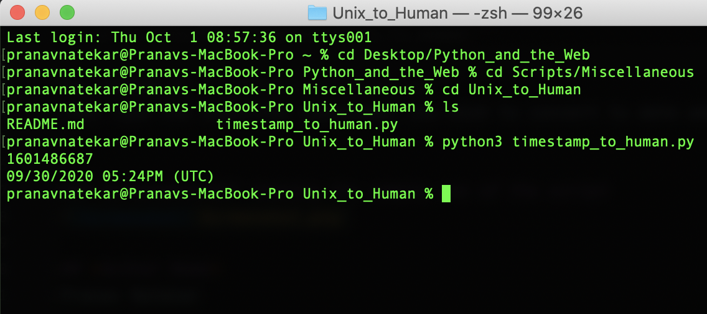

# Python script that converts UNIX timestamp to huam interpretable format
A simple Python script that uses 'time(inbuilt)' module to convert timestamp to data and time format.

### Prerequisites
```time``` Module
* The time module is inbuilt with Python. 

### How to run the script
First you have to go to the Unix_to_Human directory. Run the following command once you are in project directory

```cd Scripts/Miscellaneous/Unix_to_Human```

For Python 3: ```python3 wifiSpeed.py```
Then type the input(the timestamp) you wish to convert to date and time.


### Screenshot/GIF showing the sample use of the script


## *Author Name*
Pranav Natekar