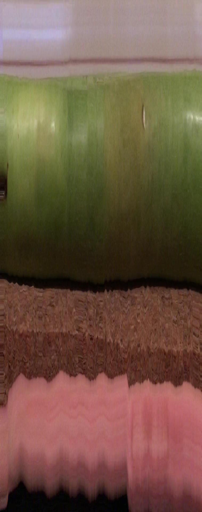
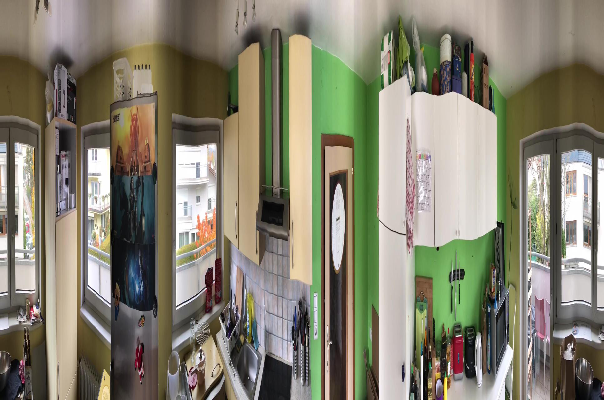

# unwrap.py

Unwraps a video into a flattened texture using ffmpeg.

### Prerequisites
```pip3 install pillow```

ffmpeg, available from [here.](https://ffmpeg.org)

### How to run the script
Move the videos you want unwrapped into the media directory, then run:

```python3 unwrap.py```

### Screenshot/GIF showing the sample use of the script
Example video is located in media.

This might not look like much, but with better source videos the unwrapped picture will be more meaningful too.

Creating textures from objets:


Creating panoramas:


## *Author Name*
<!--Remove the below lines and add yours -->
Made with ♥ by [valterm](http://github.com/valterm)
