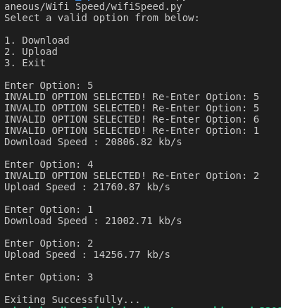

# Python script that provides the download and upload speed of your Wifi
A simple Python script that uses 'speedtest' module to test the internet bandwidth of your connection.

### Prerequisites
You will need to install speedtest module. 
The installation commands are provided in requirements.txt
```bash
  pip install -r requirements.txt
```

### How to run the script
First you have to go to the Wifi_Speed directory. Run the following command once you are in project directory

```cd Scripts/Miscellaneous/Wifi_Speed```

For Python 3: ```python3 wifiSpeed.py```
For Python 2: ```python wifiSpeed.py```

### Screenshot/GIF showing the sample use of the script


## *Author Name*
Adesh Choudhar
