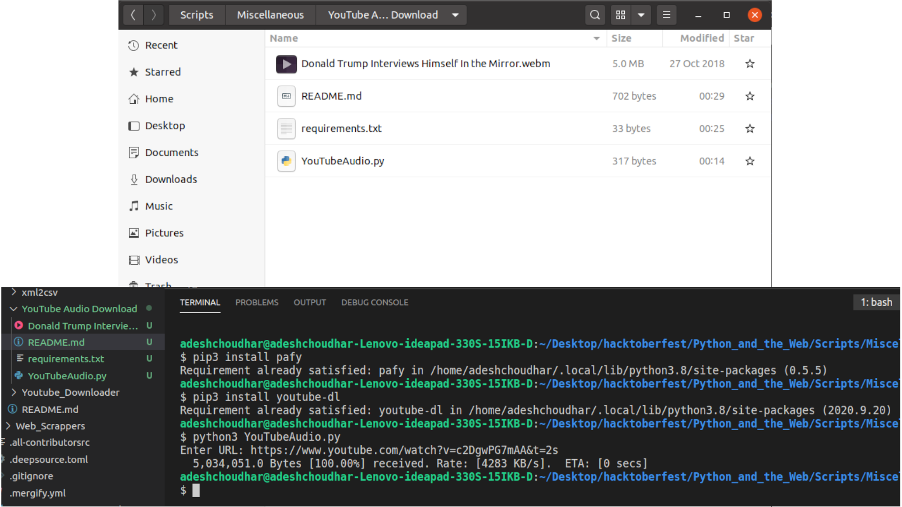

# Python script that provides the download and upload speed of your Wifi
A simple Python script that uses 'pafy' library to download audio from YouTube URLs of that particular video.

### Prerequisites
You will need to install pafy library and also youtube-dl library too. You can use commands which are visible in Screenshot.png.

### How to run the script
First you have to go to the 'YouTube Audio Download' directory. Run the following command once you are in project directory

```cd Scripts/Miscellaneous/YouTube Audio Download```

For Python 3: ```python3 YouTubeAudio.py```

### Screenshot/GIF showing the sample use of the script


## *Author Name*
Adesh Choudhar
