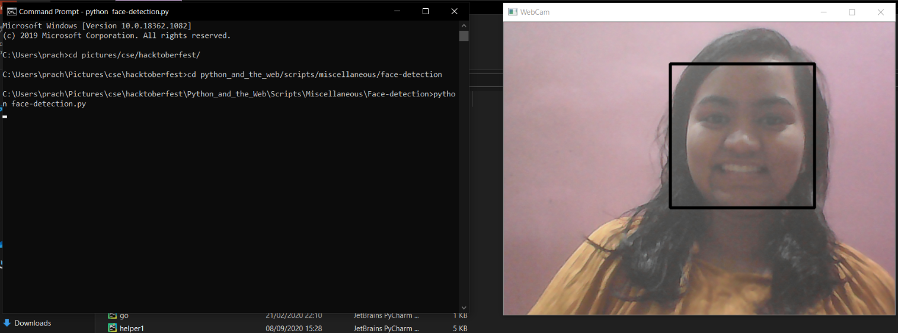

# Face Detection in Python using webcam

A simple python script to detect faces in a webcam.<br>

## Requeriments

<p> Python 3 </p>

<p>opencv-python package</p>

<p>To install opencv, on command prompt type -

```pip install opencv-python```

</p>

<p>Downloading haar cascade files</p>
<p>Open the following link to download haar cascade xml file, keep it in the same folder as face-detection.py </p>
```https://drive.google.com/file/d/15dnrarVLAUzysNj0gF00vu8T4g7U0yaN/view```


## Running the script

<p> On command prompt/ terminal, Change to the face-detection directory </p>

``` cd Python_and_the_web/Scripts/Miscellaneous/Face-detection ```
<p> Run the face-detection.py script </p>

``` python face-detection.py ```

<p> To exit the execution -  press q </p>

## Screenshot



## Author 

<p> Mitanshi Kshatriya </p>


