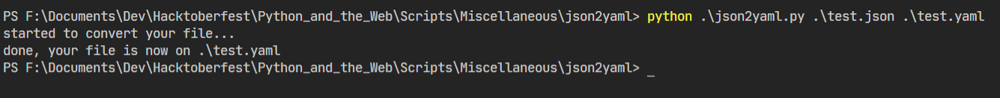

# Python script that provides the download and upload speed of your Wifi

A simple Python script that uses 'pyyaml' module to conver an input json file into a output yaml file.

### Prerequisites

You will need to install pyyaml. 
The installation commands are provided in requirements.txt

### How to run the script

First you have to go to the json2yaml directory. Run the following command once you are in project directory

```bash
    cd Scripts/Miscellaneous/json2yaml
```

For Python 3: 
```bash
    python json2yaml.py jsonFilePath yamlFilePath
```

### Screenshot/GIF showing the sample use of the script



## *Author Name*

David Mendoza