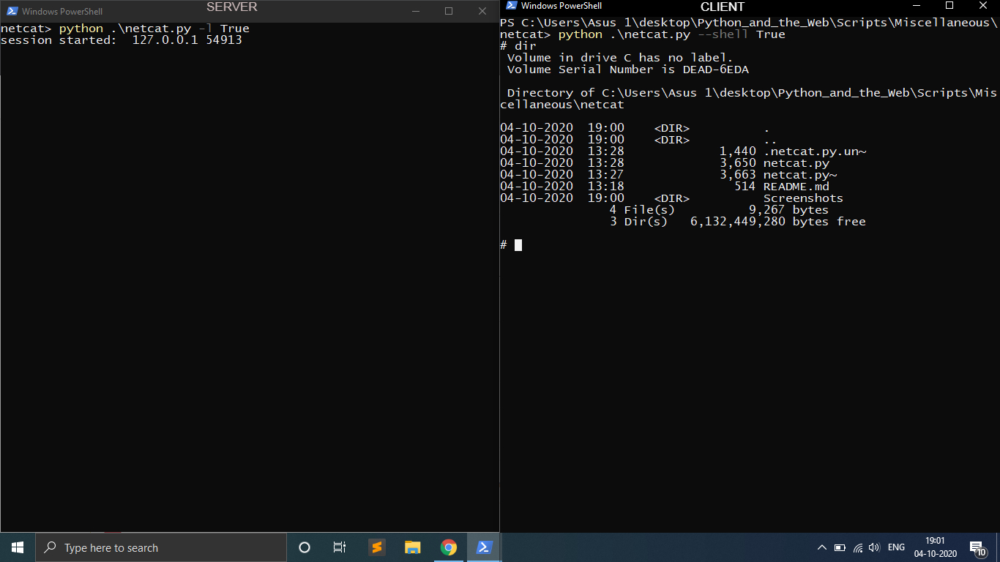

# Netcat #
netcat is very well known tool to remotely connect to any machine which have open connection. This is simple implementation of this tool. With this script user can start a server or connect to server or even upload a file to another machine remotely. use help switch to discover more available options of the script.


## Usage ##
```
$ python3 netcat.py -l True
```

For Help use
```
$ python3 netcat.py -h
```

# working screenshots #


## Author name
<a href="https://github.com/jaesharma">Jayesh sharma</a>

