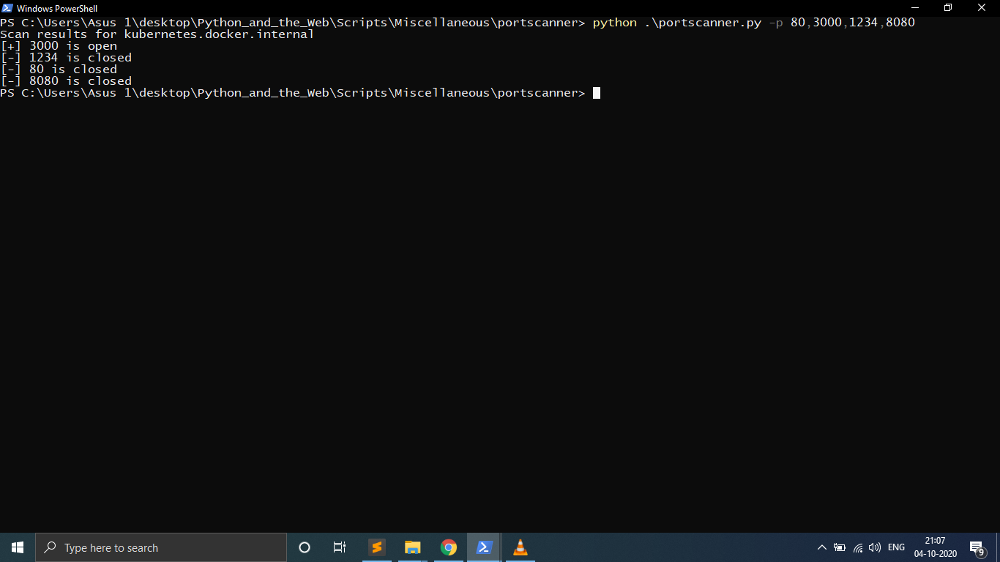

# portscanner #

A python script to scan the ports on your local system or the system you have access to remotely.
common usage: 
   python portscanner.py --host <hostname> -port <portnumber>

for more available options use --help switch.
   python portscanner.py --help

# working screenshot #

# Author #
<a href="https://github.com/jaesharma">Jayesh sharma</a>