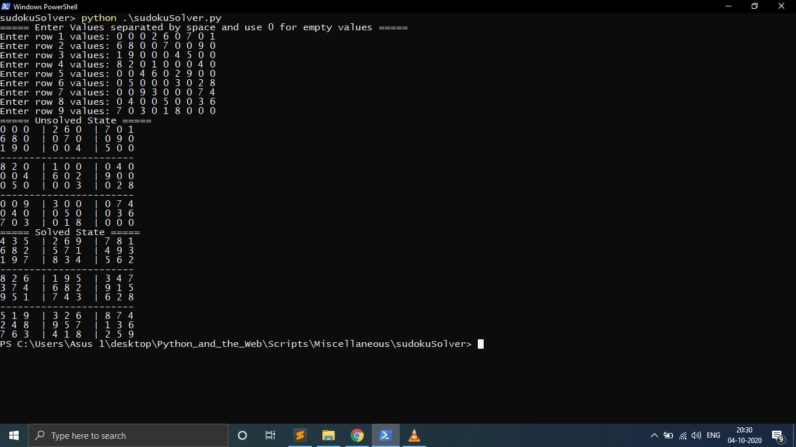

# Python script to solve sudoku
A Python script that can solve any sudoku no matter how complex it is.

### How to run the script

```cd Scripts/Miscellaneous/SudokuSolver```

```python3 sudokuSolver.py```

# working screeshot #


## *Author Name*
<a href="https://github.com/jaesharma">Jayesh sharma</a>
