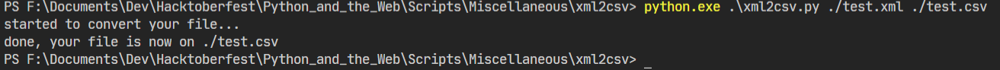

# Python script that provides the download and upload speed of your Wifi

A simple Python script that uses 'xmltodict' module to convert an input xml file into a output json object, and then to a flat csv.

### Prerequisites

You will need to install xmltodict. 
The installation commands are provided in requirements.txt

### How to run the script

First you have to go to the xml2csv directory. Run the following command once you are in project directory

```bash 
    cd Scripts/Miscellaneous/xml2csv
```

For Python 3:
```bash
    python xml2csv.py xmlFilePath csvFilePath
```

### Screenshot/GIF showing the sample use of the script



## *Author Name*

David Mendoza