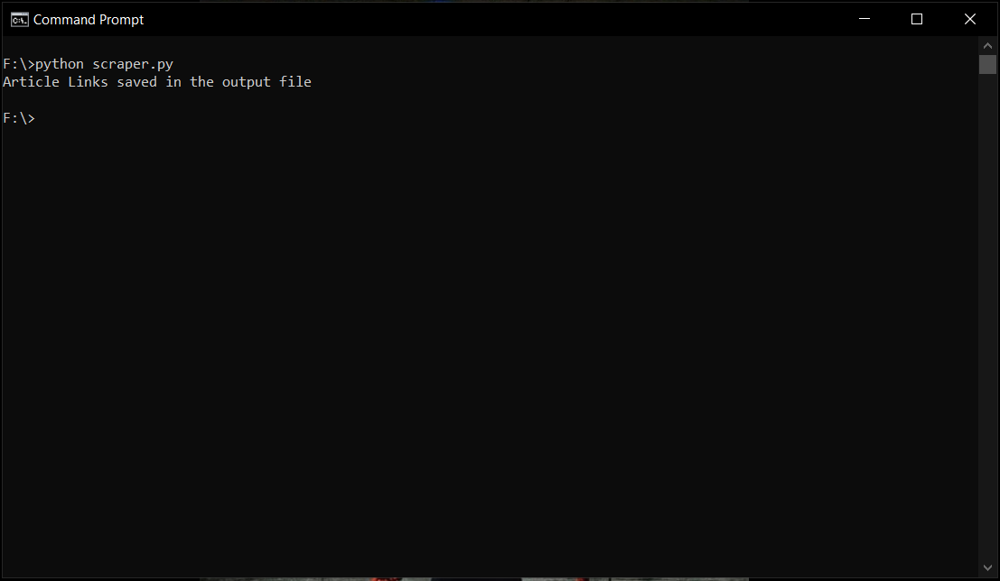
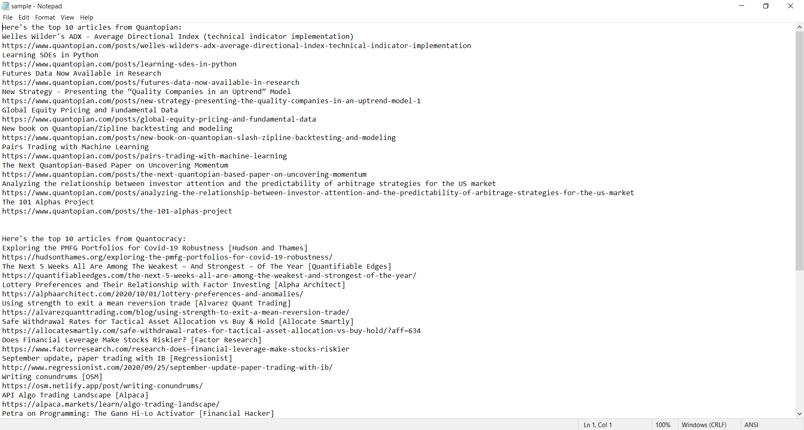

## Algorithmic Trading & Mathematical Finance Articles Scrapper
### What this script does?
Scrapes top articles of algorithmic trading and mathematical finance from quantopian, quantstart and quantocarcy. 

**Quantopian** - Quantopian is a Boston-based company that aims to create a crowd-sourced hedge fund by letting freelance quantitative analysts develop, test, and use trading algorithms to buy and sell securities. 
**Quantstart** - Quantocracy is a curated mashup of trading blogs that deal in the quantitative and the empirical. 
**Quantocracy** - QuantStart is an online portal for mathematical finance articles and tutorials on derivatives pricing, primarily to help prospective quants gain a role in quantitative finance.

### How to use this script?
- Run the below command to make sure libraries used in this script are installed: 
`pip install -r requirements.txt`

- Run the following command: 
`python scraper.py`

### Script in Action

### Script Output Text File

