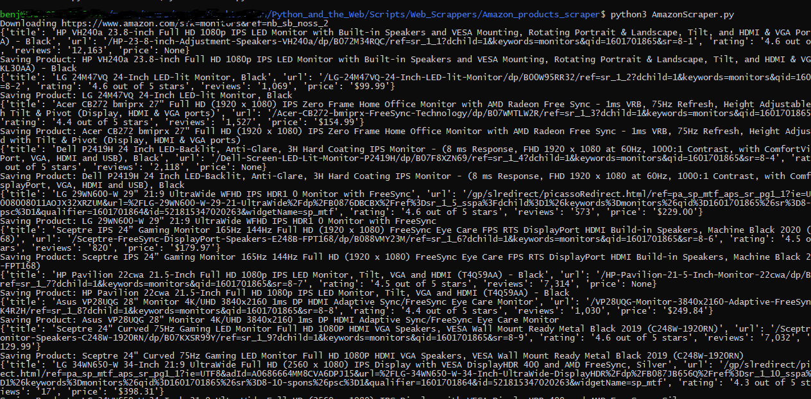

# Amazon Products Scraper 

Scrapes all the data from a given amazon search result url.

### Pre-requisites

	- Python 3
	- requests
	- selectorlib

### Instructions to run
	Input your item search url in the search_products.txt
		Ex:
			https://www.amazon.com/s?k=monitors&ref=nb_sb_noss_2

  	> python3 AmazonScraper.py

  	Output will be in a jsonl format and can be found in the product_search_output.jsonl file.

## Screenshot - Sample Use

## Author

	Benji (https://github.com/CaptainRoberts)
