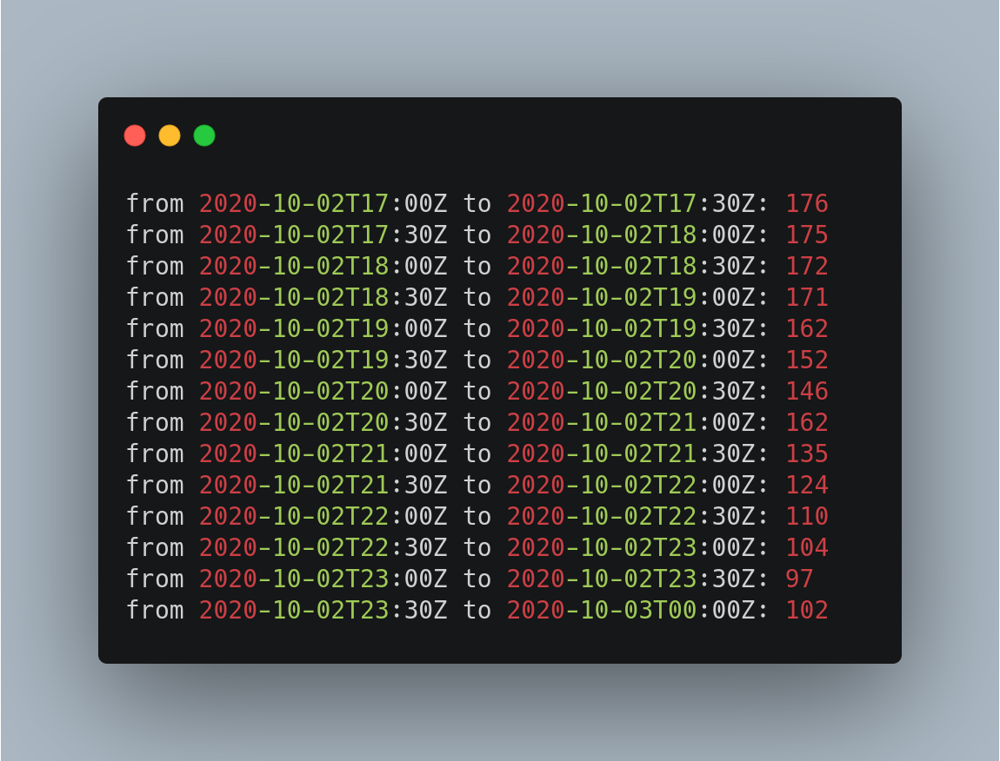

# CO2 Emission

Scrape data from the CarbonIntensity API between two dates.

## Pre-requisites
- Python 3
- Requests library

## How to run
Execute in your terminal:
```
python co2_emission.py
```



### Author
[Jr Miranda](https://github.com/jrmiranda)