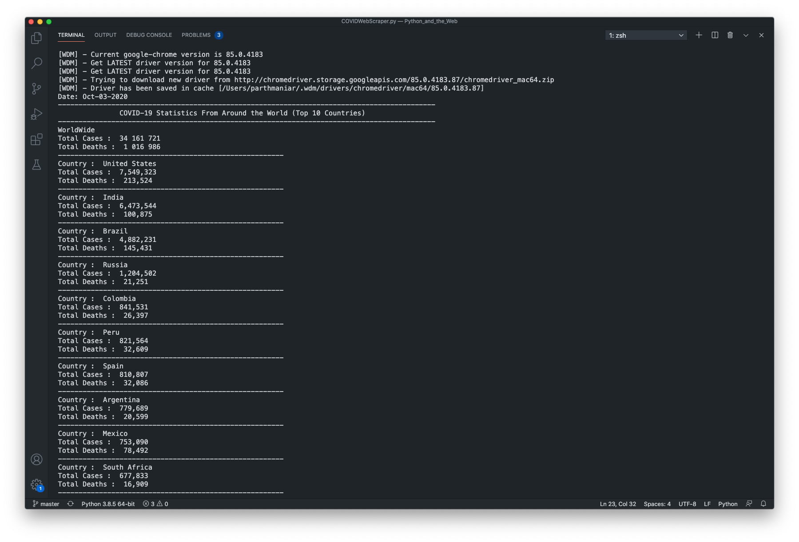

# COVID-19 Information Scraper
<!--Remove the below lines and add yours -->
Python Web Scraper which Extracts Information Retaled to COVID-19(Number of Cases, Number of Deaths) for Top 10 Affected Countries

### Pre=requisites

[`Python 3`](https://www.python.org/downloads/ "Download Python"),
[`webdriver-manager`](https://pypi.org/project/webdriver-manager/ "Download webdriver-manager"),
[`selenium`](https://pypi.org/project/selenium/ "Download webdriver-manager"),
[`beautifulsoup4`](https://pypi.org/project/beautifulsoup4/ "Download webdriver-manager")

Selenium (Web Scrapping Python Library)
ChromeDriver (Used for Automated Navigation to URLs, which are Provided by Selenium as Input.
Pandas (Data Manipulation Library)

### Instructions to run
<!--Remove the below lines and add yours -->
It is a single python file. 

 ```shell
  ❯ python3 COVIDWebScraper.py
  ```

### Screens




## Author
<!--Remove the below lines and add yours -->

**[tauseefmohammed2](https://github.com/tauseefmohammed2)**

**[Parth Maniar](https://github.com/officialpm)**

